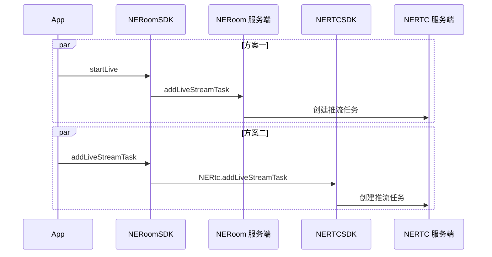

NERoom 基于专业的跨平台视频编解码技术和大规模视频内容分发网络，提供稳定流畅、高可靠、高并发的直播服务，助力轻松打造企业级在线直播平台。

## 适用范围

本文内容介绍了如何调用 NERoom 提供的基础直播能力。如果您有具体的直播相关的业务场景，请优先参考上层业务组件：

- 在线直播：适用于社交娱乐、购物、健身、赛事直播、路演、在线拍卖等大型互动直播场景。详情请参考 [在线直播方案概述](https://doc.yunxin.163.com/pk/concept/jg2MTU0Nzc?platform=client)。
- 语聊房：适用于语聊 + K 歌、语聊 + 一起听、游戏开黑、多人相亲等多种娱乐社交玩法。详情请参考 [语聊房方案概述](https://doc.yunxin.163.com/group-voice-room/concept/TMzNTAwODU?platform=client)。

## 功能介绍

直播的应用场景包括：

- **娱乐直播**：面向秀场、游戏等直播场景，提供直播秒开、色彩滤镜、主播观众直播连麦等功能，提高直播人气，活跃直播气氛。
- **电商直播**：电商直播方案实现用户在看直播中边看边卖，支持时移商品介绍、用户互动等，实现快速变现。
- **教育直播**：教育直播加密、动态 URL 防盗链等安全保障防止教学内容泄露，更有高可用服务链路保障教育直播的稳定性。
- **大型直播**：提供海量 CDN 网络和强大的云端媒体处理能力，保障了直播的高并发和高可用。

您可以根据需要选择 [方案一](#方案一) 或 [方案二](#方案二)。两者的区别如下：

- **方案一（推荐）**：
    - 使用更简单，提供常用的布局模板。
    - 移动客户端互动直播受限于网络状况，为保证直播的稳定性，推荐选择本方案。
    - 自动生成推拉流地址，无需单独配置。
- **方案二**：
    - 更灵活、更丰富。可以自定义画面布局、设置音视频流的相关参数。
    - 需要客户根据自身直播文档生成推拉流地址，提前传入直播信息。

## 前提条件

创建房间时，已在 `NECreateRoomOptions` 方法中，设置 `enableLive=true`，具体操作方法请参考 [创建房间](https://doc.yunxin.163.com/neroom/guide/zk1ODc5MjE?platform=android)。

## 功能原理

服务端推流和客户端推流的底层实现逻辑如下图所示。



## 方案一

1. 调用 `getRoomContext` 接口获取房间上下文。

    调用此方法时，您需要将 roomUuid 设置为您所加入房间的 ID。

2. 主播端调用 [`startLive`](https://doc.yunxin.163.com/neroom/references/android/dokka/Latest/zh/html/com/netease/yunxin/kit/roomkit/api/NERoomLiveController.html#startLive(NERoomLiveRequest,NECallback)) 接口开启直播。

    ```Kotlin
    fun startLive(request: NERoomLiveRequest, callback: NECallback<NERoomLiveInfo>)
    ```

    - `NERoomLiveRequest` 相关参数说明如下表所示。

        名称 | 描述
        --- | ---
        title | 直播主题
        password | 直播密码。如果密码为空，用户无需密码即可进入直播
        liveLayout | 直播布局，包括：<ul><li>1：画廊布局</li><li>2：聚焦布局</li><li>4：共享屏幕布局</li></ul>
        userUuidList | 推流用户的 uid 集合
        extensionConfig | 扩展配置，透传返回

    - `NERoomLiveInfo` 相关参数说明如下表所示。

        名称 | 描述
        --- | ---
        title | 直播主题
        password | 直播密码。如果密码为空，用户无需密码即可进入直播
        liveLayout | 直播布局，包括：<ul><li>1：画廊布局</li><li>2：聚焦布局</li><li>4：共享屏幕布局</li></ul>
        userUuidList | 推流用户的 uid 集合
        extensionConfig | 扩展配置，跟 `NERoomLiveRequest` 中的扩展配置保持一致
        taskId | 直播任务编号
        pushUrl | 推流地址
        pullHttpUrl | HTTP 拉流地址
        pullRtmpUrl | RTMP 拉流地址
        pullHlsUrl | HLS 拉流地址
        pullRtsUrl | RTS 拉流地址
        chatRoomId | 直播聊天室房间号
        state | 直播状态。包括：<ul><li>init: 直播未开始</li><li>started: 直播已开始</li><li>ended: 直播已结束</li><li>Invalid: 无效状态（默认）</li></ul>

    示例代码如下：

    ```Kotlin
    val roomService = NERoomKit.getInstance().getService(NERoomService::class.java);
            val roomContext = roomService.getRoomContext(roomUuid);
            val request = NERoomLiveRequest(
                title = "start",
                liveLayout = NERoomLiveLayout.NERoomLiveLayoutGallery,
                password = "4567890",
                userUuidList = listOf("444", "3424", "434"),
                extensionConfig = "extensionConfig"
            )
            roomContext?.liveController?.startLive(request, object : NECallback2<NERoomLiveInfo>() {

                override fun onSuccess(data: NERoomLiveInfo?) {
                    super.onSuccess(data)
                }

                override fun onError(code: Int, message: String?) {
                    super.onError(code, message)
                }

            });
    ```

3. 调用 [`updateLive`](https://doc.yunxin.163.com/neroom/references/android/dokka/Latest/zh/html/com/netease/yunxin/kit/roomkit/api/NERoomLiveController.html#updateLive(NERoomLiveRequest,NECallback)) 接口更新直播。

    参数说明请参考 `startLive` 中的参数说明。

    示例代码如下：

    ```Kotlin
    val roomService = NERoomKit.getInstance().getService(NERoomService::class.java);
            val roomContext = roomService.getRoomContext(roomUuid);
            val request = NERoomLiveRequest(
                title = "update",
                liveLayout = NERoomLiveLayout.NERoomLiveLayoutGallery,
                password = "4567890",
                userUuids = listOf("444", "3424", "434"),
                extensionConfig = "extensionConfig"
            )
            roomContext?.liveController?.updateLive(request, object : NECallback2<NERoomLiveInfo>() {

                override fun onSuccess(data: NERoomLiveInfo?) {
                    super.onSuccess(data)
                }

                override fun onError(code: Int, message: String?) {
                    super.onError(code, message)
                }

            });
    ```

4. 调用 [`stopLive`](https://doc.yunxin.163.com/neroom/references/android/dokka/Latest/zh/html/com/netease/yunxin/kit/roomkit/api/NERoomLiveController.html#stopLive(NECallback)) 接口停止直播。

    示例代码如下：

    ```Kotlin
    val roomService = NERoomKit.getInstance().getService(NERoomService::class.java);
            val roomContext = roomService.getRoomContext(roomUuid);
            roomContext?.liveController?.stopLive(object : NECallback2<Unit>() {

                override fun onSuccess(data: Unit?) {
                    super.onSuccess(data)
                }

                override fun onError(code: Int, message: String?) {
                    super.onError(code, message)
                }

            })
    ```

5. 调用 [`getLiveInfo`](https://doc.yunxin.163.com/neroom/references/android/dokka/Latest/zh/html/com/netease/yunxin/kit/roomkit/api/NERoomLiveController.html#getLiveInfo()) 接口获取直播信息。

    参数说明请参考 `startLive` 中的参数说明。

    示例代码如下：

    ```Kotlin
    val roomService = NERoomKit.getInstance().getService(NERoomService::class.java);
            val roomContext = roomService.getRoomContext(roomUuid);
            val liveInfo = roomContext?.liveController?.getLiveInfo()
    ```

6. 当直播状态变更，会触发 `NERoomListener` 协议中的回调方法 `onRoomLiveStateChanged` 通知房间内成员直播状态变更。

    监听直播状态变更的示例代码如下：

    ```Kotlin
    val roomService = NERoomKit.getInstance().getService(NERoomService::class.java);
            val roomContext = roomService.getRoomContext(roomUuid);
            roomContext?.addRoomListener(object : NERoomListener {

                override fun onRoomLiveStateChanged(state: NERoomLiveState) {
                    TODO("Not yet implemented")
                }

            }
    ```

## 方案二

:::note notice

- 一个房间最多创建 3 个旁路推流任务。
- 提前调用 [创建频道](https://doc.yunxin.163.com/live-streaming/server-apis/TkzNzkzNTk?platform=server#创建频道) 接口创建直播，并传入直播信息。
:::

1. 调用 `getRoomContext` 接口获取房间上下文。

    调用此方法时，您需要将 roomUuid 设置为您所加入房间的 ID。

2. 调用 `addLiveStreamTask` 接口添加旁路推流任务。

    ::: note note
    每次只能增加一路旁路推流地址。如需推送多路流，则需多次调用该方法。
    :::

    `NERoomLiveStreamTaskInfo` 的参数说明如下表所示。

    参数 | 说明
    --- | ---
    config | 配置音视频流编码参数。具体参数说明请参考下表。
    extraInfo | 预留参数，用户自定义的发送到旁路推流客户端的信息，用于填充视频中 SEI 帧内容。<br>长度不能超过 4096 字节。
    layout | 自定义房间画面的各路视频布局方式。具体参数说明请参考下表。
    mode | 直播推流模式。可设置为：ModeAudio：推流纯音频。ModeVideo：推流音视频。
    serverRecordEnabled | 旁路推流是否需要进行音视频录制。可设置为：true：启动录制。false：关闭录制（默认）。
    taskId | 自定义的推流任务 ID。请保证此 ID 唯一。<br>taskId 由字母、数字、下划线（_）组成，最大 64 个字符。
    streamUrl | 推流地址。例如 rtmp://example.url。

    `config` 的参数说明如下表所示。

    参数 | 说明
    --- | ---
    singleVideoPassThrough | true：表示开启视频透传。开启后，如果房间中只有一路视频流输入，则不对输入视频流进行转码，不遵循转码布局，直接推流 CDN。<br>false（默认）：表示关闭视频透传。关闭后，无论房间中是否只有一路视频流，都按照 `layout` 设置的布局进行转码推流。
    audioBitrate | 音频推流码率。单位为 kbps，取值范围为 10~192。语音场景建议设置为 64 及以上码率，音乐场景建议设置为 128 及以上码率。
    sampleRate | 音频推流采样率。默认值为 NERtcLiveStreamAudioSampleRate48000 48K。
    channels | 音频推流声道数。1：单声道。2：双声道（默认）。
    audioCodecProfile | 音频编码规格。包括 `ProfileHEAAC` 和 `ProfileLCAAC`。

    `layout` 的参数说明如下表所示。

    参数 | 类型 | 是否必选 | 描述
    --- | --- | --- | ---
    height | Integer | 是 | 整体画布的高度，单位为 px。<br>取值范围为 0~1920，若设置为奇数值，会自动向下取偶。
    width | Integer | 是 | 整体画布的宽度，单位为 px。<br>取值范围为 0~1920，若设置为奇数值，会自动向下取偶。
    backgroundColor | String | 否 | 画面背景颜色，默认为 0，即黑色。支持以下格式的颜色码：<ul><li>256 ✖ 256 ✖ R + 256 ✖ G + B 的和。请将对应 RGB 的值分别带入此公式计算即可。</li><li>十六进制颜色码，即#RRGGBB 或 RRGGBB 格式。例如 #CC00FF。</li></ul>
    backgroundImg | String | 否 | 设置混流视频中占位图片属性。相关参数说明如下：<ul><li>`url`：占位图片的 URL。例如：www.163.com/test.jpg。</li><li>`height`：该占位图片在画布中的高度。取值范围为 0~1920，若设置为奇数值，会自动向下取偶。</li><li>`width`：该占位图片在画布中的宽度。取值范围为 0~1920，若设置为奇数值，会自动向下取偶。</li><li>`x`：设置占位图片左上角在画布的横轴坐标值。取值范围为 0~1920，若设置为奇数值，会自动向下取偶。</li><li>`y`：设置占位图片左上角在画布的纵轴坐标值。取值范围为 0~1920，若设置为奇数值，会自动向下取偶。</li></ul>
    userTranscodingList | String | 是 | 房间内各成员布局的数组。

    画面布局的效果展示及常用布局的配置示例请参考 [旁路推流画面布局](https://doc.yunxin.163.com/interactive-streaming/guide/TY2MjkzODM?platform=android#布局示例)。

3. （可选）调用 `updateLiveStreamTask` 接口更新房间内的旁路推流任务。

    ```Kotlin
    val taskInfo = NERoomLiveStreamTaskInfo().apply {
                taskId = "taskId"
                streamUrl = "streamUrl"
                serverRecordEnabled = false
                mode = NERoomLiveStreamMode.ModeVideo
                layout = NERoomLiveStreamLayout().apply {
                    width = 640
                    height = 720
                    backgroundColor = 0
                    backgroundImg = NERoomLiveStreamImageInfo().apply {
                        width = 640
                        height = 720
                        url = "url"
                        x = 0
                        y = 0
                    }
                    val list = ArrayList<NERoomLiveStreamUserTranscoding>()
                    list.add(NERoomLiveStreamUserTranscoding().apply {
                        uuid = "uuid"
                        videoPush = true
                        audioPush = true
                        adaption = NERoomLiveStreamVideoScaleMode.ScaleFit
                        x = 0
                        y = 0
                        width = 360
                        height = 640
                        zOrder = 0
                    })
                    userTranscodingList = list

                }
                config = NERoomLiveConfig().apply {
                        singleVideoPassThrough = false
                        audioBitrate = 0
                        channels = 0
                        sampleRate = NERoomLiveStreamAudioSampleRate.Rate32000
                        audioCodecProfile = NERoomLiveStreamAudioCodecProfile.ProfileHEAAC

                }
                extraInfo = "extraInfo"
            }
            NERoomKit.instance.roomService.getRoomContext(roomUuid)?.liveController?.addLiveStreamTask(taskInfo)
    ```

4. 调用 `removeLiveStreamTask` 接口删除旁路推流任务。

    ```Kotlin
    NERoomKit.instance.roomService.getRoomContext(roomUuid)?.liveController?.removeLiveStreamTask(taskID)
    ```

## API 参考

方法 | 功能描述
--- | ---
[startLive](https://doc.yunxin.163.com/neroom/references/android/dokka/Latest/zh/html/com/netease/yunxin/kit/roomkit/api/NERoomLiveController.html#startLive(NERoomLiveRequest,NECallback)) | 开启直播
[stopLive](https://doc.yunxin.163.com/neroom/references/android/dokka/Latest/zh/html/com/netease/yunxin/kit/roomkit/api/NERoomLiveController.html#stopLive(NECallback)) | 停止直播
[updateLive](https://doc.yunxin.163.com/neroom/references/android/dokka/Latest/zh/html/com/netease/yunxin/kit/roomkit/api/NERoomLiveController.html#updateLive(NERoomLiveRequest,NECallback)) | 更新直播
[getLiveInfo](https://doc.yunxin.163.com/neroom/references/android/dokka/Latest/zh/html/com/netease/yunxin/kit/roomkit/api/NERoomLiveController.html#getLiveInfo()) | 获取直播信息
[addLiveStreamTask](https://doc.yunxin.163.com/neroom/references/android/dokka/Latest/zh/html/com/netease/yunxin/kit/roomkit/api/NERoomLiveController.html#addLiveStreamTask(NERoomLiveStreamTaskInfo,NECallback)) | 添加旁路推流
[updateLiveStreamTask](https://doc.yunxin.163.com/neroom/references/android/dokka/Latest/zh/html/com/netease/yunxin/kit/roomkit/api/NERoomLiveController.html#updateLiveStreamTask(NERoomLiveStreamTaskInfo,NECallback)) | 更新旁路推流
[removeLiveStreamTask](https://doc.yunxin.163.com/neroom/references/android/dokka/Latest/zh/html/com/netease/yunxin/kit/roomkit/api/NERoomLiveController.html#removeLiveStreamTask(String,NECallback)) | 删除旁路推流