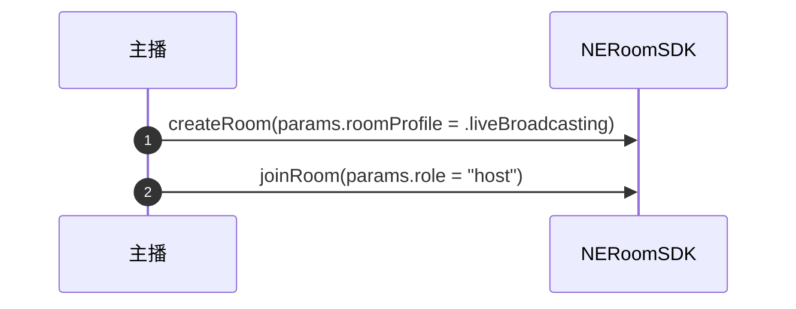
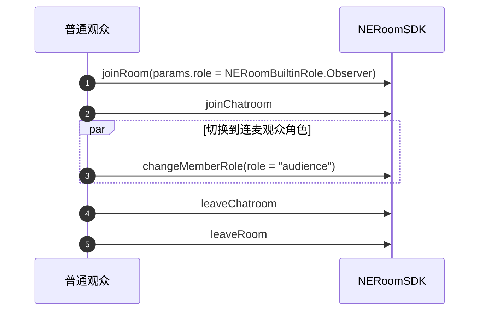
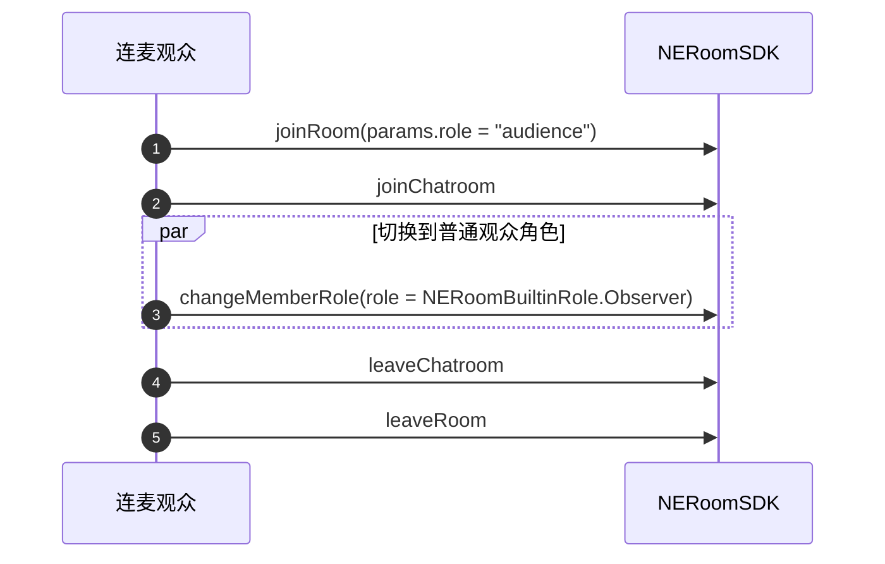

本文介绍如何通过 NERoom 实现超大房间直播互动，满足体育赛事直播、秀场直播、企业大型会议、在线教育等用户数上千或上万的应用场景。

## 适用范围

本文介绍如何通过 NERoom 实现超大型互动直播业务。如果您有具体的直播相关的业务场景，包括社交娱乐、购物、健身、赛事直播、路演、在线拍卖等，请优先参考上层业务组件在线直播（Livekit)。更多详情，请参考 [在线直播方案概述](https://doc.yunxin.163.com/pk/concept/jg2MTU0Nzc?platform=client)。

## 应用场景

- **体育赛事直播**：主播创建房间直播世界杯等体育赛事，球迷们加入直播间一起观赛，边看边聊。用户可以举手上麦，与房间内其他上麦的观众进行实时的语音聊天，而其他不上麦的观众可以观看并收听麦上用户之间的交流，并通过文字、表情等形式对比赛进行点评和互动。
- **KOL 秀场直播**：随着网红经济持续火爆，网红大 V 直播间的观众人数常常超过百万。NERoom 超大房间直播能力，助力您快速搭建属于自己的娱乐社交平台。
- **企业大型会议**：企业年会、培训大会、学术研讨会等企业大型会议的场景中，需要发言的用户可以举手上麦，与主持人进行实时语音聊天。
- **互动大班课**：老师创建课堂进行线上教学，成千上万学生在线观看，学生通过连麦与老师互动，让课堂互动畅通无阻。主要用于 K12 教育、留学语言培训、职业技能培训、公考求职、兴趣培养等线上互动教学场景。

## 名词解释

- **普通观众**：加入房间但不进行音视频互动的用户。普通观众只能观看直播内容、发送消息，不占用 RTC 音视频资源，人数无上限。普通观众加入房间时角色设置为 `NERoomBuiltinRole.Observer`。
- **连麦观众**：已加入房间并且能够进行音视频互动的观众。连麦观众可以和主播以及其他连麦观众进行实时语音或视频交流，占用 RTC 资源，人数上限为 20 人。连麦观众加入房间时角色设置为 `audience`。
- **主持人**：房间的创建者和管理者，拥有最高权限。主持人可以进行音视频直播、管理连麦观众、控制房间秩序等。主持人加入房间时角色设置为 `host`。
- **RTC**：Real-Time Communication，实时通信技术。在超大房间场景中，RTC 用于连麦观众和主持人之间的实时音视频互动。
- **直播流**：主播产生的音视频数据流，可通过 CDN 分发给大量普通观众观看。
- **角色切换**：用户在房间中身份的转变，例如普通观众可以通过 `changeMemberRole` 方法切换为连麦观众，反之亦然。
- **聊天室**：NERoom 中内置的文字消息交流系统，所有类型的用户(包括普通观众和连麦观众)都可以在聊天室中发送和接收消息。

## 使用限制

功能 | 限制 |
---- | ---- |
连麦观众人数 | 20 人 |
普通观众人数 | 无限制 |
收发消息 | 支持
音视频互动 | 支持

## 前提条件

已 [开通 NERoom 房间组件](https://doc.yunxin.163.com/neroom/concept/DQzNTEwMDE?platform=client)，并且绑定 **互动直播** 模板。

## 功能原理


原理说明如下：
- 用户加入 NERoom 房间时，设置用户的角色是连麦观众或普通观众。
- 连麦观众通过 RTC 进行音视频互动。
- 普通观众支持消息互动，通过播放器拉流观看主播和麦上观众的视频。
- 普通观众进出房间事件通过 `onReceiveChatroomMessages` 回调中的 `NERoomChatNotificationMessage` 消息来通知，NERoom 服务器不再管理普通成员的成员列表，将成员列表完全托管给聊天室，以此来节省开支。
- 如果需要获取普通观众的成员列表，请通过 `NERoomChatController` 中的 `fetchChatroomMembers` 接口来获取。

**时序图**

主播创建并加入大房间



普通观众加入并切换到连麦观众



连麦观众加入并切换到普通观众



## 实现方法

1. 创建房间时，设置房间属性为直播场景。

    调用 [`NERoomService.createRoom`](https://doc.yunxin.163.com/neroom/references/android/dokka/Latest/zh/html/com/netease/yunxin/kit/roomkit/api/service/NERoomService.html#createRoom(NECreateRoomParams,NECreateRoomOptions,NECallback)) 接口创建房间，将 `NECreateRoomParams.roomProfile` 参数设置为 `LIVE_BROADCASTING` 直播场景，该场景中支持超大房间。

2. 加入房间。
    - 主播调用 [joinRoom](https://doc.yunxin.163.com/neroom/references/android/dokka/Latest/zh/html/com/netease/yunxin/kit/roomkit/api/service/NERoomService.html#joinRoom(NEJoinRoomParams,NEJoinRoomOptions,NECallback)) 接口加入房间，并将用户角色 `NEJoinRoomParams.role` 设置为 `host`。
    - 麦上观众调用 [joinRoom](https://doc.yunxin.163.com/neroom/references/android/dokka/Latest/zh/html/com/netease/yunxin/kit/roomkit/api/service/NERoomService.html#joinRoom(NEJoinRoomParams,NEJoinRoomOptions,NECallback)) 接口加入房间，并将用户角色 `NEJoinRoomParams.role` 设置为 `audience`。

    - 普通观众调用 [joinRoom](https://doc.yunxin.163.com/neroom/references/android/dokka/Latest/zh/html/com/netease/yunxin/kit/roomkit/api/service/NERoomService.html#joinRoom(NEJoinRoomParams,NEJoinRoomOptions,NECallback)) 接口加入房间，并将用户角色 `NEJoinRoomParams.role` 设置为 `NERoomBuiltinRole.Observer`。

3. 观众角色切换。

    调用 [changeMemberRole](https://doc.yunxin.163.com/neroom/references/android/dokka/Latest/zh/html/com/netease/yunxin/kit/roomkit/api/NERoomContext.html#changeMemberRole(String,String,NECallback)) 接口，实现普通观众和麦上观众的角色切换。角色切换成功后，本端触发 `onMemberRoleChanged` 回调。
    - 从麦上观众切换为普通观众时，远端用户触发 `onUserLeaved` 回调。
    - 从普通观众切换为麦上观众时，远端用户触发 `onUserJoined` 回调。

## 示例代码

```Java
    // 创建直播大房间
    NECreateRoomParams params = new NECreateRoomParams("123", "直播房测试" , templateId, null, null, new HashMap(), NERoomProfile.LIVE_BROADCASTING);
    NERoomKit.getInstance().getRoomService().createRoom(params, null, callback);

    // 主播加入
    NEJoinRoomParams joinParams = new NEJoinRoomParams("123", "主播" , null, "host", null, new HashMap());
    NERoomKit.getInstance().getRoomService().joinRoom(joinParams, callback);

    // 普通观众加入
    NEJoinRoomParams joinParams = new NEJoinRoomParams("123", "普通观众" , null, NERoomBuiltinRole.Observer, null, new HashMap());
    NERoomKit.getInstance().getRoomService().joinRoom(joinParams, callback);

    // 连麦观众加入
    NEJoinRoomParams joinParams = new NEJoinRoomParams("123", "连麦观众" , null, "audience", null, new HashMap());
    NERoomKit.getInstance().getRoomService().joinRoom(joinParams, callback);

    // 普通观众切换到连麦观众
    roomContext.changeMemberRole(userUuid, "audience");

    // 连麦观众切换到普通观众
    roomContext.changeMemberRole(userUuid, NERoomBuiltinRole.Observer);
```