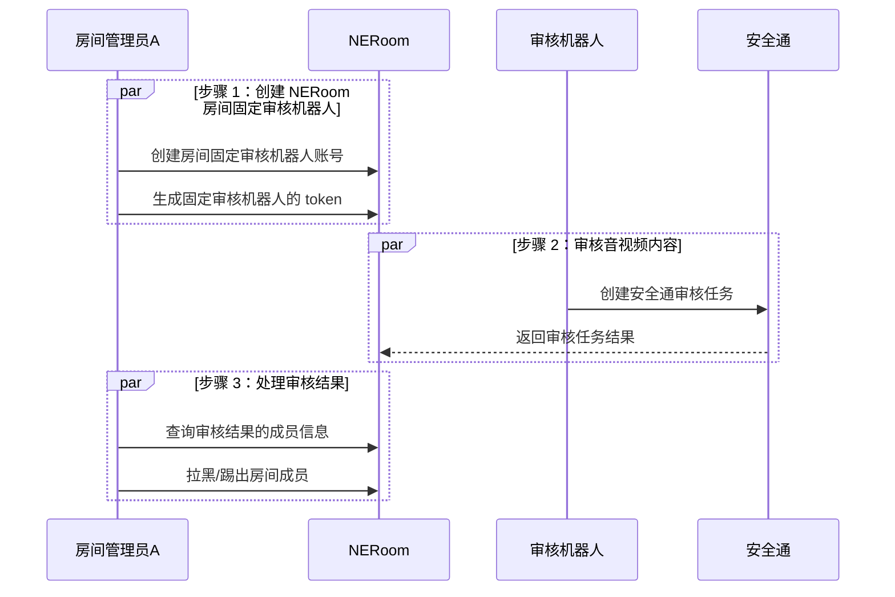

网易云信 NERoom 支持安全通反垃圾（内容审核）功能。

## 功能描述

安全通是网易云信提供的内容安全增值业务，为您提供全方位的内容安全检测服务。在国家对互联网内容安全政策监管日趋严格和规范的大背景下，为您的产品营收稳定增长保驾护航。

NERoom 支持对音视频流中的广告、暴力、涉政、色情、欺诈等内容进行实时检测。

开通安全通功能并配置安全通检测规则后，NERoom 会对音视频进行异步检测，即音视频不会被拦截，但是您可以同时对指定的音视频进行安全审核，根据审核结果可以对房间中的用户进行拉黑、踢人或禁言操作。

## 前提条件

- [开通和配置音视频安全通](https://doc.yunxin.163.com/nertc/server-apis/zMzMTYzNDM?platform=server)。
- [开通和配置消息抄送](https://doc.yunxin.163.com/messaging/server-apis/jY5MDk1NTQ?platform=server)。

## 实现音视频内容审核

### 实现流程

### 实现步骤

1. 创建房间固定审核机器人。

    通过 [创建音视频通话账号](https://doc.yunxin.163.com/neroom/server-apis/DQ1NDY2MjY?platform=server) 接口创建一个房间固定审核机器人账号（uid），用于音视频应用在用户加入房间时的进行安全检测。

2. 生成固定审核机器人的鉴权 token。

    通过 NERoom 的 `roomUuid` 和 `uid` 生成 Token。具体请参考 [Token 鉴权](https://doc.yunxin.163.com/nertc/server-apis/TcxNDAxMTI?platform=server#获取-token) 。

    其中 NERoom 的 `roomUuid` 实际对应 NERTC 的 `channelName`。

3. 创建音视频审核任务。

    通过 [创建安全通审核任务](https://doc.yunxin.163.com/nertc/server-apis/DA3OTIwNzg?platform=server) 接口开启安全检测。

4. 接收审核结果。

    当音视频内容没有违规，不会触发审核抄送。只有在音视频内容违规时，才会触发异常抄送。

5. 查询审核结果中的成员信息。

    通过审核结果中的 `uid` [查询 NERoom 房间成员信息](https://doc.yunxin.163.com/neroom/server-apis/zY1NTAyMjA?platform=server) （`uuid`）。

6. 处理违规成员。

    - 通过 [添加黑名单](https://doc.yunxin.163.com/neroom/server-apis/DU5NTI0NDQ?platform=server) 接口拉黑违规成员。
    - 通过 [移出房间成员](https://doc.yunxin.163.com/neroom/server-apis/TIxNjQ5NTA?platform=server) 接口将违规成员踢出房间。
    - 通过 [成员禁言](https://doc.yunxin.163.com/neroom/server-apis/DA0MjI3ODc?platform=server) 接口禁言违规成员。