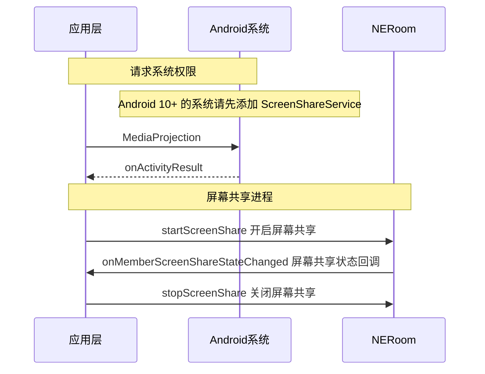
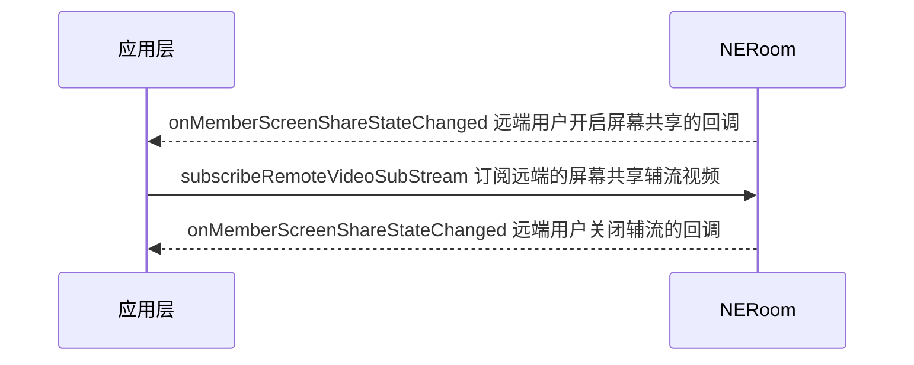
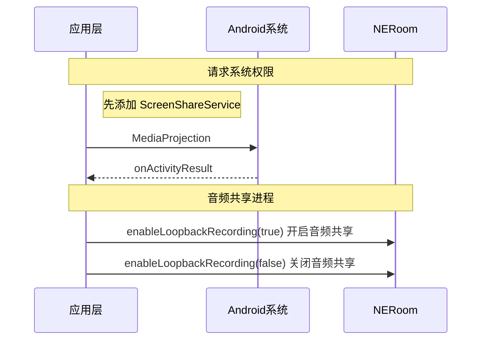

在大型会议或在线教育等场景中，为了满足提升沟通效率的需求，主讲人或老师需要将本端的屏幕内容分享给远端参会者或在线学生观看。NERoom 支持屏幕共享功能，帮助您实时分享本端设备的屏幕内容，满足在线教育、互动娱乐、金融面签、视频会议等低延时高互动场景的需求。

## 功能介绍

通过 NERoom SDK 可以在视频通话中实现屏幕共享和音频共享，主播或连麦者可以将自己的屏幕内容、本地播放的音频流，分享给远端参会者或在线观众观看，从而提升沟通效率，一般适用于多人视频聊天、在线会议以及在线教育场景。

- 视频会议场景中，参会者可以在会议中将本地的文件、数据、网页、PPT 等画面分享给其他与会者，也可以通过共享音频，将本地的音频文件、PPT 背景音等所有系统声音分享给其他与会者，让其他与会者更加直观的了解讨论的内容和主题。

- 在线课堂场景中，老师可以通过屏幕共享将课件、笔记、教学内容等画面展示给远端的其他学生观看，也可以通过共享音频，将课件、教学视频的背景音等所有系统声音分享给远端的学生，降低传统教学模式下的沟通成本，提升教育场景的用户体验。

NERoom SDK 以辅流的形式实现屏幕共享，即单独为屏幕共享开启一路上行的视频流，摄像头的视频流作为主流，屏幕共享的视频流作为辅流，两路视频流并行，主播同时上行摄像头画面和屏幕画面两路画面。

## 注意事项

- 在开始屏幕共享前，请确保已在您的项目中实现基本的实时音视频功能。
- 您需要先调用 [`joinRoom`](https://doc.yunxin.163.com/neroom/api-refer/android/dokka/Latest/zh/html/com/netease/yunxin/kit/roomkit/api/service/NERoomService.html#joinRoom(NEJoinRoomParams,NEJoinRoomOptions,NECallback)) 进入房间，再通过 [`joinRtcChannel`](https://doc.yunxin.163.com/neroom/api-refer/android/dokka/Latest/zh/html/com/netease/yunxin/kit/roomkit/api/NERoomRtcController.html#joinRtcChannel(NECallback)) 加入音视频房间，才能使用屏幕共享功能。
- MediaProjection 等 API 需要 Android API level 21+，使用方法请参考 [Google MediaProjection API](https://developer.android.com/reference/android/media/projection/MediaProjection)  文档。
- **Android 10** 及以后的版本，使用屏幕共享和音频共享功能时，需要开启一个前台服务，因此需要在 `AndroidManifest.xml` 中添加 service，同时将 **compileSdkVersion** 设置为 29。请根据您的业务需求添加 service。

## 本端共享屏幕

### <span id="API 调用时序">**API 调用时序**</span>

开发 Android 系统的应用时，您需要使用 Android 原生 API 和 NERoom API 共同实现屏幕共享功能。API 调用时序如下图所示。


  


### 配置步骤

1. 在 `AndroidManifest.xml` 文件中添加前台服务 `ScreenShareService`。
2. 通过 `MediaProjection` 创建 `ScreenCaptureIntent` 请求屏幕共享权限，并将 intent 传递给 `startActivityForResult()` 。
3. 在加入房间之后调用 [`startScreenShare`](https://doc.yunxin.163.com/neroom/api-refer/android/dokka/Latest/zh/html/com/netease/yunxin/kit/roomkit/api/NERoomRtcController.html#startScreenShare(Intent,MediaProjection.Callback,NECallback)) 方法开启屏幕共享，以辅流形式发送屏幕共享内容。调用此方法时，您需要传入请求权限后返回的 `screenShareResultData`，并设置 `MediaProjection.Callback()` 以接收屏幕共享状态回调。
4. 开启屏幕共享后，房间内其他成员会收到 [`onMemberScreenShareStateChanged`](https://doc.yunxin.163.com/neroom/api-refer/android/dokka/Latest/zh/html/com/netease/yunxin/kit/roomkit/api/NERoomListener.html#onMemberScreenShareStateChanged(NERoomMember,Boolean,NERoomMember)) 回调，通知房间内其他成员关于您屏幕共享状态的变更。
5. 若您要结束屏幕共享，请调用 [`stopScreenShare`](https://doc.yunxin.163.com/neroom/api-refer/android/dokka/Latest/zh/html/com/netease/yunxin/kit/roomkit/api/NERoomRtcController.html#stopScreenShare(NECallback)) 方法关闭辅流形式的屏幕共享。

### 示例代码

```
//需要在 AndroidManifest.xml 中添加前台服务
       <service
            android:name=".services.ScreenShareService"
            android:foregroundServiceType="mediaProjection">
            <intent-filter>
                <action android:name="com.netease.Yunxin.ScreenShare" />
            </intent-filter>
        </service>
        
public class RoomActivity extends AppCompatActivity {
    private ScreenShareServiceConnection mServiceConnection;
    private ScreenShareService mScreenService;
      private class ScreenShareServiceConnection implements ServiceConnection {

        @Override
        public void onServiceConnected(ComponentName componentName, IBinder service) {
            if (service instanceof ScreenShareService.ScreenShareBinder) {
                mScreenService = ((ScreenShareService.ScreenShareBinder) service).getService();
            }
        }

        @Override
        public void onServiceDisconnected(ComponentName componentName) {
            mScreenService = null;
        }
    }

    private ActivityResultLauncher<Intent> launcher = registerForActivityResult(
            new ActivityResultContracts.StartActivityForResult(), new ActivityResultCallback<ActivityResult>() {

                @Override
                public void onActivityResult(ActivityResult result) {
                    Log.d(TAG, "onActivityResult,result:" + result.getResultCode());
                    if (result.getResultCode() == Activity.RESULT_OK) {
                        mScreenService.startScreenShare(currentRoomContext.getRtcController(), result.getData(),
                                new MediaProjection.Callback() {

                                    @Override
                                    public void onStop() {
                                        super.onStop();
                                        Log.d(TAG,"屏幕共享结束");
                                    }
                                }, new NECallback<Unit>() {

                                    @Override
                                    public void onResult(int code, @Nullable String message, @Nullable Unit unit) {
                                        Log.d(TAG, "code:" + code);
                                        if (code == NEErrorCode.SUCCESS) {
                                            Log.d(TAG,"开始屏幕共享");
                                        }
                                    }
                                });
                    }
                }
            });
            
      @Override
    protected void onCreate(@Nullable Bundle savedInstanceState) {
        super.onCreate(savedInstanceState);
        setContentView(R.layout.activity_room);
        bindScreenService();
           findViewById(R.id.startScreenShare).setOnClickListener(new View.OnClickListener() {

            @Override
            public void onClick(View view) {
                MediaProjectionManager mediaProjectionManager = (MediaProjectionManager) getSystemService(
                        Context.MEDIA_PROJECTION_SERVICE);
                launcher.launch(mediaProjectionManager.createScreenCaptureIntent());
            }
        });
        findViewById(R.id.stopScreenShare).setOnClickListener(new View.OnClickListener() {

            @Override
            public void onClick(View view) {
                mScreenService.stopScreenShare(currentRoomContext.getRtcController(), new NECallback<Unit>() {

                    @Override
                    public void onResult(int code, @Nullable String message, @Nullable Unit unit) {
                        Log.d(TAG,"结束屏幕共享");
                    }
                });
            }
        });
    }
    
        @Override
    protected void onDestroy() {
        super.onDestroy();
        unbindScreenService();
    }
    
     private void bindScreenService() {
        Intent intent = new Intent();
        intent.setClass(this, ScreenShareService.class);
        mServiceConnection = new ScreenShareServiceConnection();
        bindService(intent, mServiceConnection, Context.BIND_AUTO_CREATE);
    }
    
       private void unbindScreenService() {
        if (mServiceConnection != null) {
            unbindService(mServiceConnection);
        }
    }
}
```
## 观看远端屏幕共享
### <span id="API 调用时序">**API 调用时序**</span>



  

### 注意事项

必须在指定用户开启了屏幕共享辅流通道后，即收到 [`onMemberScreenShareStateChanged`](https://doc.yunxin.163.com/neroom/api-refer/android/dokka/Latest/zh/html/com/netease/yunxin/kit/roomkit/api/NERoomListener.html#onMemberScreenShareStateChanged(NERoomMember,Boolean,NERoomMember)) 回调后，才能订阅该远端用户的辅流。

```
    /**
     * 成员屏幕共享状态回调
     * @param member 成员
     * @param isSharing 是否正在进行屏幕共享
     */
    fun onMemberScreenShareStateChanged(member: NERoomMember, isSharing: Boolean)
```

### 配置步骤

1. 远端用户加入音视频房间。
2. 收到 [`onMemberScreenShareStateChanged`](https://doc.yunxin.163.com/neroom/api-refer/android/dokka/Latest/zh/html/com/netease/yunxin/kit/roomkit/api/NERoomListener.html#onMemberScreenShareStateChanged(NERoomMember,Boolean,NERoomMember)) 其他用户开启屏幕共享辅流通道的回调。
3. 调用 [`subscribeRemoteVideoSubStream`](https://doc.yunxin.163.com/neroom/api-refer/android/dokka/Latest/zh/html/com/netease/yunxin/kit/roomkit/api/NERoomRtcController.html#subscribeRemoteVideoSubStream(String)) 方法订阅远端的屏幕共享辅流视频，订阅之后才能接收远端的辅流视频数据。调用此方法时，您需要设置指定用户的 Uuid，同时设置 subscribe 参数为 true。
4. 收到 [`onMemberScreenShareStateChanged`](https://doc.yunxin.163.com/neroom/api-refer/android/dokka/Latest/zh/html/com/netease/yunxin/kit/roomkit/api/NERoomListener.html#onMemberScreenShareStateChanged(NERoomMember,Boolean,NERoomMember)) 其他用户关闭屏幕共享辅流通道的回调，结束屏幕共享。

### 示例代码

```
if (remoteMember.isSharingScreen()) {
         NERoomService roomService = NERoomKit.getInstance().getService(NERoomService.class);
         NERoomContext currentRoomContext = roomService.getRoomContext(roomUuid);
         if (currentRoomContext != null) {
         currentRoomContext.getRtcController().subscribeRemoteVideoSubStream(remoteMember.getUuid(), true,
                                                new NECallback2<Unit>() {

                                                    @Override
                                                    public void onSuccess(
                                                            @Nullable Unit unit) {
                                                        Log.d(TAG, "success");
                                                    }

                                                    @Override
                                                    public void onError(int code,
                                                                        @Nullable String message) {
                                                        Log.d(TAG, "error");
                                                    }
                                                });
                                    }
         }
```

## 关闭某成员的屏幕共享

在会议等场景中，主持人可以关闭某成员的屏幕共享。

::: note note
您可以在云信控制台上配置某角色是否具备该权限，只有具备该权限的角色才可以执行此操作。
:::

  
### 配置步骤
1. 调用 [`stopMemberScreenShare`](https://doc.yunxin.163.com/neroom/api-refer/android/dokka/Latest/zh/html/com/netease/yunxin/kit/roomkit/api/NERoomRtcController.html#stopMemberScreenShare(String,NECallback))关闭房间内某成员的屏幕共享。相关的参数说明如下表所示。

参数 | 说明 | 
---- | -------------- |
userUuid | 待关闭屏幕共享的成员的 uuid。 | 
callback |回调|

2. 房间内其他成员会收到 [`onMemberScreenShareStateChanged`](https://doc.yunxin.163.com/neroom/api-refer/android/dokka/Latest/zh/html/com/netease/yunxin/kit/roomkit/api/NERoomListener.html#onMemberScreenShareStateChanged(NERoomMember,Boolean,NERoomMember)) 回调，通知房间内其他成员关于屏幕共享状态的变更。

### 示例代码

```
        NERoomService roomService = NERoomKit.getInstance().getService(NERoomService.class);
        NERoomContext roomContext = roomService.getRoomContext(roomUuid);
        if (roomContext != null) {
            String userUuid = "uuid";
            roomContext.getRtcController().stopMemberScreenShare(userUuid, new NECallback2<Unit>() {
                @Override
                public void onSuccess(@Nullable Unit unit) {
                    Log.d(TAG,"success");
                }

                @Override
                public void onError(int code, @Nullable String message) {
                    Log.d(TAG,"error");
                }
            });
        }
```

## 音频共享

### **API 调用时序**

开发 Android 系统的应用时，您需要使用 Android 原生 API 和 NERoom API 共同实现音频共享功能。API 调用时序如下图所示。



  

### **配置步骤**
1. 在 `AndroidManifest.xml` 文件中添加前台服务 `ScreenShareService`。
2. 通过 `MediaProjection` 创建 `ScreenCaptureIntent` 请求屏幕共享权限，并将 intent 传递给 `startActivityForResult()` 。
3. 在加入房间后调用 <a href="https://doc.yunxin.163.com/neroom/api-refer/android/dokka/Latest/zh/html/com/netease/yunxin/kit/roomkit/api/NERoomRtcController.html#enableLoopbackRecording(Boolean,Intent,MediaProjection.Callback)" target="_blank">`enableLoopbackRecording`</a> 方法。调用此方法时，您需要设置 `enable` 参数为 true 开启音频共享，传入请求权限后返回的 intent data，并设置 `MediaProjection.Callback()` 用于接收音频共享状态回调。
4. 需要结束音频共享时，调用 <a href="https://doc.yunxin.163.com/neroom/api-refer/android/dokka/Latest/zh/html/com/netease/yunxin/kit/roomkit/api/NERoomRtcController.html#enableLoopbackRecording(Boolean,Intent,MediaProjection.Callback)" target="_blank">`enableLoopbackRecording`</a> 方法并设置 `enable` 参数为 false 停止音频共享。

### **示例代码**

```
if(enableAudioShare){
    // 在开启音频共享之前，需要先申请录屏权限获取 Intent，并启动 ForegroundService；
    // 参考屏幕共享中的流程实现，这里不再赘述。
    if(Build.VERSION.SDK_INT >= Build.VERSION_CODES.Q) {
            int nRet = roomContext.getRtcController().enableLoopbackRecording(true, ScreenShareService.mediaProjectionIntent, new MediaProjection.Callback() {
                @Override
                public void onStop() {
                    mUIHandler.post(new Runnable() {
                    @Override
                    public void run() {
                        Log.w(TAG, "系统录音已停止");
                    }});
                    super.onStop();
        }});
    }
}else {
    roomContext.getRtcController().enableLoopbackRecording(false, null, null);
}
```

## API 参考
| **方法** | **功能描述** |
|:--|:--|
|[joinRoom](https://doc.yunxin.163.com/neroom/api-refer/android/dokka/Latest/zh/html/com/netease/yunxin/kit/roomkit/api/service/NERoomService.html#joinRoom(NEJoinRoomParams,NEJoinRoomOptions,NECallback))|加入 NERoom 的房间。|
|[joinRtcChannel](https://doc.yunxin.163.com/neroom/api-refer/android/dokka/Latest/zh/html/com/netease/yunxin/kit/roomkit/api/NERoomRtcController.html#joinRtcChannel(NECallback))|加入音视频房间。|
|[startScreenShare](https://doc.yunxin.163.com/neroom/api-refer/android/dokka/Latest/zh/html/com/netease/yunxin/kit/roomkit/api/NERoomRtcController.html#startScreenShare(Intent,MediaProjection.Callback,NECallback))|开始屏幕共享。|
|[stopScreenShare](https://doc.yunxin.163.com/neroom/api-refer/android/dokka/Latest/zh/html/com/netease/yunxin/kit/roomkit/api/NERoomRtcController.html#stopScreenShare(NECallback))|结束屏幕共享。|
|[onMemberScreenShareStateChanged](https://doc.yunxin.163.com/neroom/api-refer/android/dokka/Latest/zh/html/com/netease/yunxin/kit/roomkit/api/NERoomListener.html#onMemberScreenShareStateChanged(NERoomMember,Boolean,NERoomMember))|成员屏幕共享状态回调。|
|[subscribeRemoteSubStreamVideo](https://doc.yunxin.163.com/neroom/api-refer/android/dokka/Latest/zh/html/com/netease/yunxin/kit/roomkit/api/NERoomRtcController.html#subscribeRemoteVideoSubStream(String))|	订阅或取消订阅指定远端用户辅流视频。|
|[stopMemberScreenShare](https://doc.yunxin.163.com/neroom/api-refer/android/dokka/Latest/zh/html/com/netease/yunxin/kit/roomkit/api/NERoomRtcController.html#stopMemberScreenShare(String,NECallback))|关闭房间内某成员的屏幕共享。|
|[enableLoopbackRecording](https://doc.yunxin.163.com/neroom/api-refer/android/dokka/Latest/zh/html/com/netease/yunxin/kit/roomkit/api/NERoomRtcController.html#enableLoopbackRecording(Boolean,Intent,MediaProjection.Callback))|开启或关闭音频共享。|
