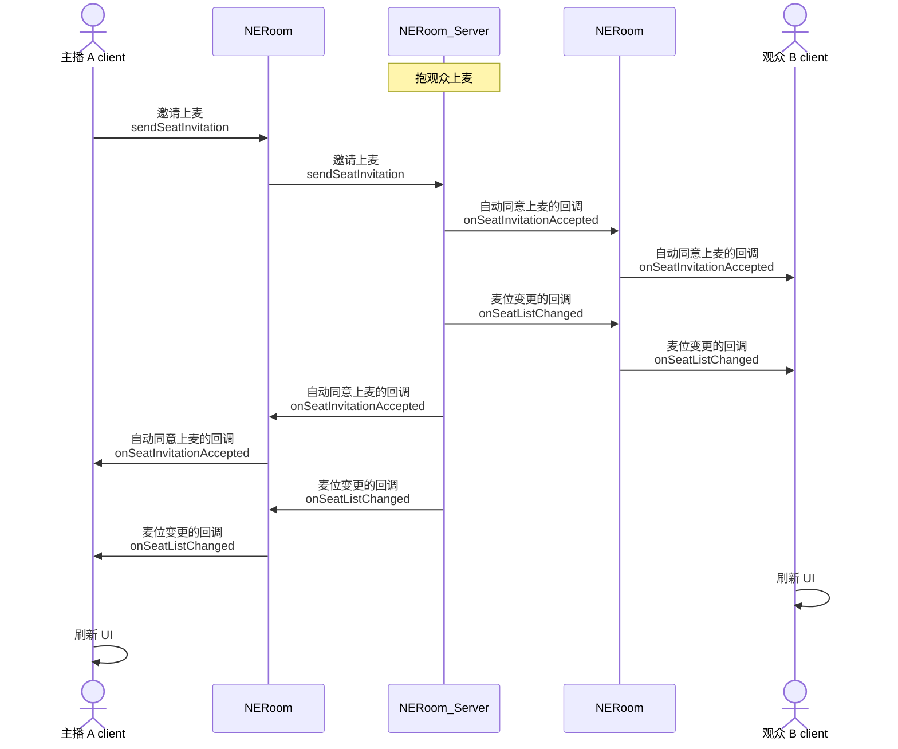
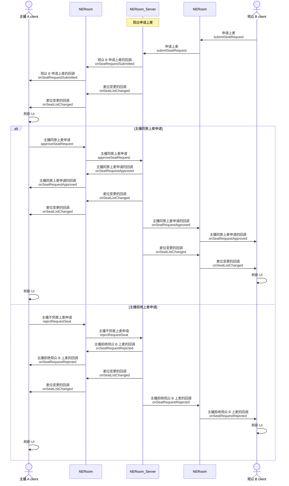
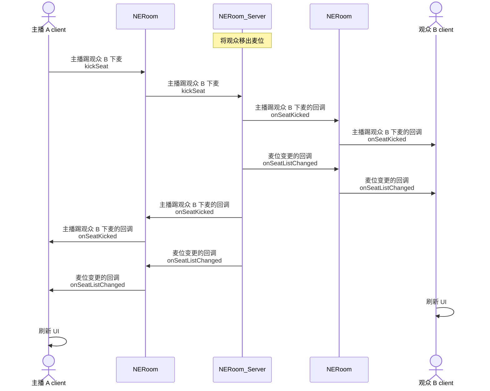
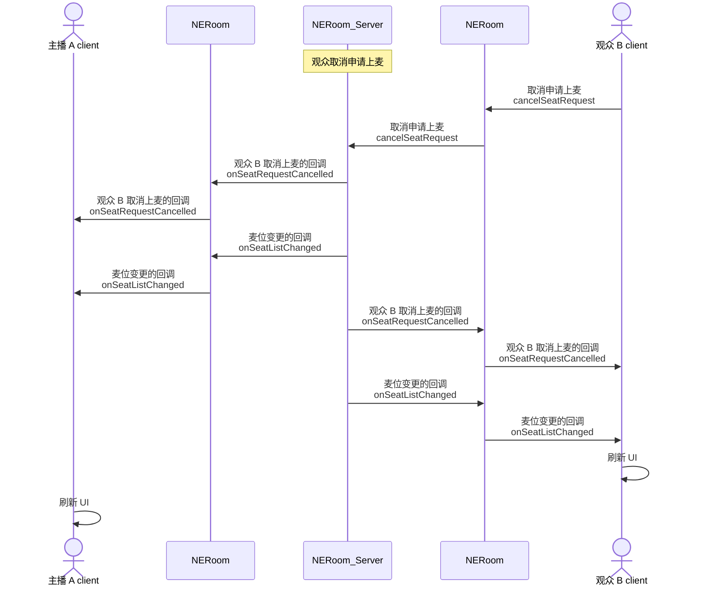
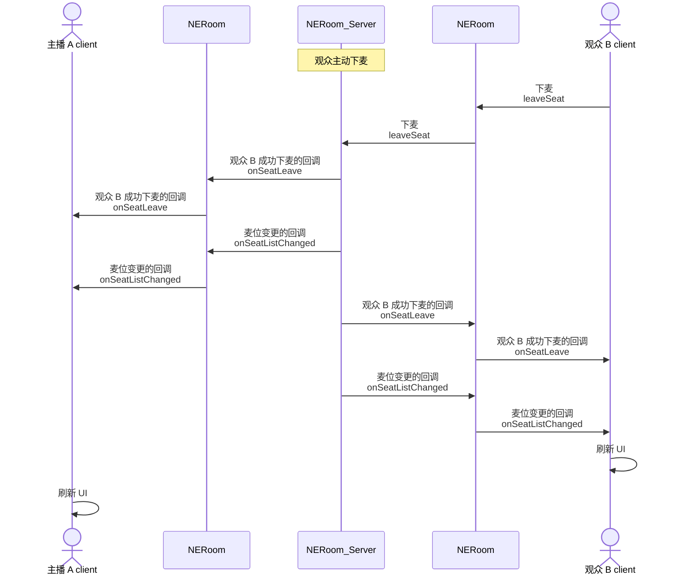

网易云信 NERoom 的麦位管理功能包括：上麦、下麦、抱麦、踢麦等。在语聊房、K 歌、直播等场景中，主播和观众连麦是非常热门的玩法。通过多人实时互动，可以活跃房间氛围、激发观众参与热情，进而提升产品活跃度。

## 注意事项

- 您可以在创建房间时，设置麦位相关的初始化配置，包括麦位数量和麦位申请审批模式，具体请参考 [创建房间](https://doc.yunxin.163.com/neroom/guide/zk1ODc5MjE?platform=android)。
- 目前只支持在创建房间时设置麦位数量，麦位数量最大为 20，在房间正常使用过程中无法修改麦位数量。

## 添加麦位事件监听

主播和观众进入房间后，调用 `addSeatListener` 接口，监听麦位相关的事件。

示例代码如下：

```Java
NERoomService roomService = NERoomKit.getInstance().getService(NERoomService.class);
        NERoomContext roomContext = roomService.getRoomContext(roomUuid);
        if (roomContext != null) {
            roomContext.getSeatController().addSeatListener(new NESeatEventListener() {

            @Override
            public void onSeatManagerAdded(List<String> managers) {

            }
            @Override
            public void onSeatManagerRemoved(List<String> managers) {
            }
            @Override
            public void onSeatRequestSubmitted(int seatIndex, String user) {
            }
            @Override
            public void onSeatRequestCancelled(int seatIndex, String user) {
            }
            @Override
            public void onSeatRequestApproved(int seatIndex, String user, String operateBy, boolean isAutoAgree) {

            }
            @Override
            public void onSeatRequestRejected(int seatIndex, String user, String operateBy) {

            }
            @Override
            public void onSeatInvitationReceived(int seatIndex, String user, String operateBy) {

            }
            @Override
            public void onSeatInvitationCancelled(int seatIndex, String user, String operateBy) {

            }
            @Override
            public void onSeatInvitationAccepted(int seatIndex,String user, boolean isAutoAgree) {
            }
            @Override
            public void onSeatInvitationRejected(int seatIndex, String user) {
            }
            @Override
            public void onSeatLeave(int seatIndex, String user) {
            }
            @Override
            public void onSeatKicked(int seatIndex, String user, String operateBy) {
            }
            @Override
            public void onSeatListChanged(List<NESeatItem> seatItems) {

            }
        });
        }
```

## 主播邀请观众上麦（抱麦）

### API 调用时序图



### 实现方法

1. 主播调用 `sendSeatInvitation` 接口邀请观众上麦。

    参数 | 类型 | 描述
    ---- | ---- | ----
    seatIndex | Integer | 麦位位置。<br>麦位的最大数量可以在 [创建房间](https://doc.yunxin.163.com/neroom/guide/zk1ODc5MjE?platform=android) 时设置。
    user | String | 待邀请的观众的用户 ID。 |

2. （可选）观众调用 `acceptSeatInvitation` 接口同意上麦邀请，或调用 `rejectSeatInvitation` 接口拒绝上麦邀请。

    - **若在 [创建房间](https://doc.yunxin.163.com/neroom/guide/zk1ODc5MjE?platform=android) 时设置了需要观众同意上麦**：观众需要执行该操作。
    - **若在 [创建房间](https://doc.yunxin.163.com/neroom/guide/zk1ODc5MjE?platform=android) 时设置了观众自动同意上麦**：观众无需执行该操作。

3. 触发同意上麦的回调 `onSeatInvitationAccepted` 和麦位变更的回调 `onSeatListChanged`。
4. 房间内所有成员收到 `onSeatListChanged` 回调后，刷新麦位展示的 UI。

### 示例代码

主播邀请观众上麦的示例代码如下：

```Java
String userId = "56789";
NERoomService roomService = NERoomKit.getInstance().getService(NERoomService.class);
        NERoomContext roomContext = roomService.getRoomContext(roomUuid);
        if (roomContext != null) {
            roomContext.getSeatController().sendSeatInvitation(userId,new NECallback2<Unit>() {
                @Override
                public void onSuccess(@Nullable Unit unit) {
                    super.onSuccess(unit);
                    Log.d(TAG,"success");
                }

                @Override
                public void onError(int code, @Nullable String message) {
                    super.onError(code, message);
                    Log.d(TAG,"error");
                }
            });
        }
```

主播邀请观众上麦时指定麦位的示例代码如下：

```Java
String userId = "56789";
int index = 2;
NERoomService roomService = NERoomKit.getInstance().getService(NERoomService.class);
        NERoomContext roomContext = roomService.getRoomContext(roomUuid);
        if (roomContext != null) {
            roomContext.getSeatController().sendSeatInvitation(index,userId,new NECallback2<Unit>() {
                @Override
                public void onSuccess(@Nullable Unit unit) {
                    super.onSuccess(unit);
                    Log.d(TAG,"success");
                }

                @Override
                public void onError(int code, @Nullable String message) {
                    super.onError(code, message);
                    Log.d(TAG,"error");
                }
            });
        }
```

## 观众申请上麦

### API 调用时序



### 实现方法

1. 观众 B 调用 `submitSeatRequest` 接口申请上麦。

    参数 | 类型 | 描述
    ---- | ---- | ----
    seatIndex | Integer | 指定上麦后的麦位位置。<br>该参数为可选，如果不传该参数，则自动占用当前空的麦位中的第一个。<br>麦位的最大数量可以在 [创建房间](https://doc.yunxin.163.com/neroom/guide/zk1ODc5MjE?platform=android) 时设置。

2. 主播收到观众 B 申请上麦的回调 `onSeatRequestSubmitted`。
3. 主播同意或拒绝观众 B 上麦。

    - 主播调用 `approveSeatRequest` 接口同意观众 B 上麦。

    - 主播调用 `rejectSeatRequest` 接口拒绝观众 B 上麦。

    参数 | 类型 | 描述
    ---- | ---- | ----
    user | String | 申请上麦的观众的用户 ID。 |

4. 观众 B 收到主播同意上麦申请的回调 `onSeatRequestApproved` 或主播拒绝上麦申请的回调 `onSeatRequestRejected`。

### 示例代码

```Java
//观众申请上麦时不指定麦位
NERoomService roomService = NERoomKit.getInstance().getService(NERoomService.class);
        NERoomContext roomContext = roomService.getRoomContext(roomUuid);
        if (roomContext != null) {
            roomContext.getSeatController().submitSeatRequest(new NECallback2<Unit>() {
                @Override
                public void onSuccess(@Nullable Unit unit) {
                    super.onSuccess(unit);
                    Log.d(TAG,"success");
                }

                @Override
                public void onError(int code, @Nullable String message) {
                    super.onError(code, message);
                    Log.d(TAG,"error");
                }
            });
        }

//观众申请上麦时指定麦位
int seatIndex = 2;
NERoomService roomService = NERoomKit.getInstance().getService(NERoomService.class);
        NERoomContext roomContext = roomService.getRoomContext(roomUuid);
        if (roomContext != null) {
            roomContext.getSeatController().submitSeatRequest(seatIndex,new NECallback2<Unit>() {
                @Override
                public void onSuccess(@Nullable Unit unit) {
                    super.onSuccess(unit);
                    Log.d(TAG,"success");
                }

                @Override
                public void onError(int code, @Nullable String message) {
                    super.onError(code, message);
                    Log.d(TAG,"error");
                }
            });
        }

//主播同意上麦申请
String userId = "56789";
NERoomService roomService = NERoomKit.getInstance().getService(NERoomService.class);
        NERoomContext roomContext = roomService.getRoomContext(roomUuid);
        if (roomContext != null) {
            roomContext.getSeatController().approveSeatRequest(userId,new NECallback2<Unit>() {
                @Override
                public void onSuccess(@Nullable Unit unit) {
                    super.onSuccess(unit);
                    Log.d(TAG,"success");
                }

                @Override
                public void onError(int code, @Nullable String message) {
                    super.onError(code, message);
                    Log.d(TAG,"error");
                }
            });
        }

// 主播拒绝上麦申请

String userId = "56789";
NERoomService roomService = NERoomKit.getInstance().getService(NERoomService.class);
        NERoomContext roomContext = roomService.getRoomContext(roomUuid);
        if (roomContext != null) {
            roomContext.getSeatController().rejectSeatRequest(userId,new NECallback2<Unit>() {
                @Override
                public void onSuccess(@Nullable Unit unit) {
                    super.onSuccess(unit);
                    Log.d(TAG,"success");
                }

                @Override
                public void onError(int code, @Nullable String message) {
                    super.onError(code, message);
                    Log.d(TAG,"error");
                }
            });
        }
```

## 主播将观众移出麦位（踢麦）

### API 调用时序



### 实现方法

1. 主播调用 `kickSeat` 接口将观众移出麦位。

    参数 | 类型 | 描述
    ---- | ---- | ----
    user | String | 待移出麦位的观众的用户 ID。 |

2. 房间内所有成员会收到主播将观众移出麦位的回调 `onSeatKicked` 和麦位变更的回调 `onSeatListChanged`。

### 示例代码

```Java
String userId = "56789";
NERoomService roomService = NERoomKit.getInstance().getService(NERoomService.class);
        NERoomContext roomContext = roomService.getRoomContext(roomUuid);
        if (roomContext != null) {
             roomContext.getSeatController().kickSeat(userId,new NECallback2<Unit>() {
                 @Override
                 public void onSuccess(@Nullable Unit unit) {
                     super.onSuccess(unit);
                     Log.d(TAG,"success");
                 }

                 @Override
                 public void onError(int code, @Nullable String message) {
                     super.onError(code, message);
                     Log.d(TAG,"error");
                 }
             });
        }
```

## 观众取消申请上麦

### API 调用时序



### 实现方法

1. 观众调用 `cancelSeatRequest` 接口取消申请上麦。
2. 取消申请上麦后，主播收到观众取消上麦的回调 `onSeatRequestCancelled` 和麦位变更的回调 `onSeatListChanged`。

### 示例代码

```Java
NERoomService roomService = NERoomKit.getInstance().getService(NERoomService.class);
        NERoomContext roomContext = roomService.getRoomContext(roomUuid);
        if (roomContext != null) {
             roomContext.getSeatController().cancelSeatRequest(new NECallback2<Unit>() {
                 @Override
                 public void onSuccess(@Nullable Unit unit) {
                     super.onSuccess(unit);
                     Log.d(TAG,"success");
                 }

                 @Override
                 public void onError(int code, @Nullable String message) {
                     super.onError(code, message);
                     Log.d(TAG,"error");
                 }
             });
        }
```

## 观众主动下麦

### API 调用时序



### 实现方法

1. 观众调用 `leaveSeat` 接口下麦。
2. 下麦成功后，房间内所有成员收到观众成功下麦的回调 `onSeatLeave` 和麦位变更的回调 `onSeatListChanged`。

### 示例代码

```Java
NERoomService roomService = NERoomKit.getInstance().getService(NERoomService.class);
        NERoomContext roomContext = roomService.getRoomContext(roomUuid);
        if (roomContext != null) {
             roomContext.getSeatController().leaveSeat(new NECallback2<Unit>() {
                 @Override
                 public void onSuccess(@Nullable Unit unit) {
                     super.onSuccess(unit);
                     Log.d(TAG,"success");
                 }

                 @Override
                 public void onError(int code, @Nullable String message) {
                     super.onError(code, message);
                     Log.d(TAG,"error");
                 }
             });
        }
```

## 错误码

错误码 | 错误码描述
--- | ---
1302 | 麦位已打开
1303 | 观众已申请上麦
1304 | 观众未申请上麦
1305 | 麦位已被其他观众占位
1306 | 观众已在麦上
1307 | 麦序未初始化
1308 | 麦序已初始化
1309 | 主播未将观众抱上麦
1310 | 麦位已关闭
1311 | 麦位都已被占，没有可用的麦位
1312 | 观众已被抱麦，无法再次被抱麦
1313 | 观众未在麦位上
1314 | 麦位数量不能超过 20 个

## 相关 API

API | 说明
--- | ---
[`addSeatListener`](https://doc.yunxin.163.com/neroom/references/android/dokka/Latest/zh/html/com/netease/yunxin/kit/roomkit/api/service/NERoomSeatController.html#addSeatListener(com.netease.yunxin.kit.roomkit.api.service.NESeatEventListener)) | 监听麦位相关事件
[`sendSeatInvitation`](https://doc.yunxin.163.com/neroom/references/android/dokka/Latest/zh/html/com/netease/yunxin/kit/roomkit/api/service/NERoomSeatController.html#sendSeatInvitation(java.lang.Integer,java.lang.Boolean,java.lang.String,com.netease.yunxin.kit.roomkit.api.NECallback))  | 邀请观众上麦
[`acceptSeatInvitation`](https://doc.yunxin.163.com/neroom/references/android/dokka/Latest/zh/html/com/netease/yunxin/kit/roomkit/api/service/NERoomSeatController.html#acceptSeatInvitation(com.netease.yunxin.kit.roomkit.api.NECallback)) | 同意上麦邀请
[`rejectSeatInvitation`](https://doc.yunxin.163.com/neroom/references/android/dokka/Latest/zh/html/com/netease/yunxin/kit/roomkit/api/service/NERoomSeatController.html#rejectSeatInvitation(com.netease.yunxin.kit.roomkit.api.NECallback)) | 拒绝上麦邀请
[`submitSeatRequest`](https://doc.yunxin.163.com/neroom/references/android/dokka/Latest/zh/html/com/netease/yunxin/kit/roomkit/api/service/NERoomSeatController.html#submitSeatRequest(java.lang.Integer,java.lang.Boolean,java.lang.String,com.netease.yunxin.kit.roomkit.api.NECallback)) | 申请上麦
[`approveSeatRequest`](https://doc.yunxin.163.com/neroom/references/android/dokka/Latest/zh/html/com/netease/yunxin/kit/roomkit/api/service/NERoomSeatController.html#approveSeatRequest(java.lang.String,com.netease.yunxin.kit.roomkit.api.NECallback)) | 同意观众的上麦申请
[`rejectSeatRequest`](https://doc.yunxin.163.com/neroom/references/android/dokka/Latest/zh/html/com/netease/yunxin/kit/roomkit/api/service/NERoomSeatController.html#rejectSeatRequest(java.lang.String,com.netease.yunxin.kit.roomkit.api.NECallback)) | 拒绝观众的上麦申请
[`kickSeat`](https://doc.yunxin.163.com/neroom/references/android/dokka/Latest/zh/html/com/netease/yunxin/kit/roomkit/api/service/NERoomSeatController.html#kickSeat(java.lang.String,com.netease.yunxin.kit.roomkit.api.NECallback)) | 将观众移出麦位
[`cancelSeatRequest`](https://doc.yunxin.163.com/neroom/references/android/dokka/Latest/zh/html/com/netease/yunxin/kit/roomkit/api/service/NERoomSeatController.html#cancelSeatRequest(com.netease.yunxin.kit.roomkit.api.NECallback)) | 取消上麦申请
[`leaveSeat`](https://doc.yunxin.163.com/neroom/references/android/dokka/Latest/zh/html/com/netease/yunxin/kit/roomkit/api/service/NERoomSeatController.html#leaveSeat(com.netease.yunxin.kit.roomkit.api.NECallback)) | 下麦