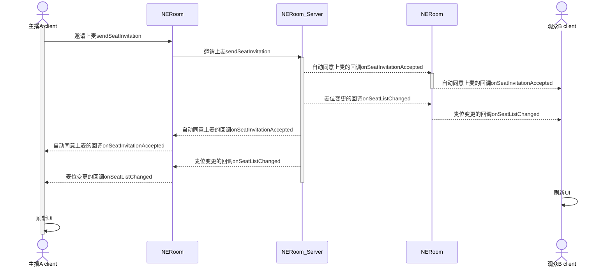
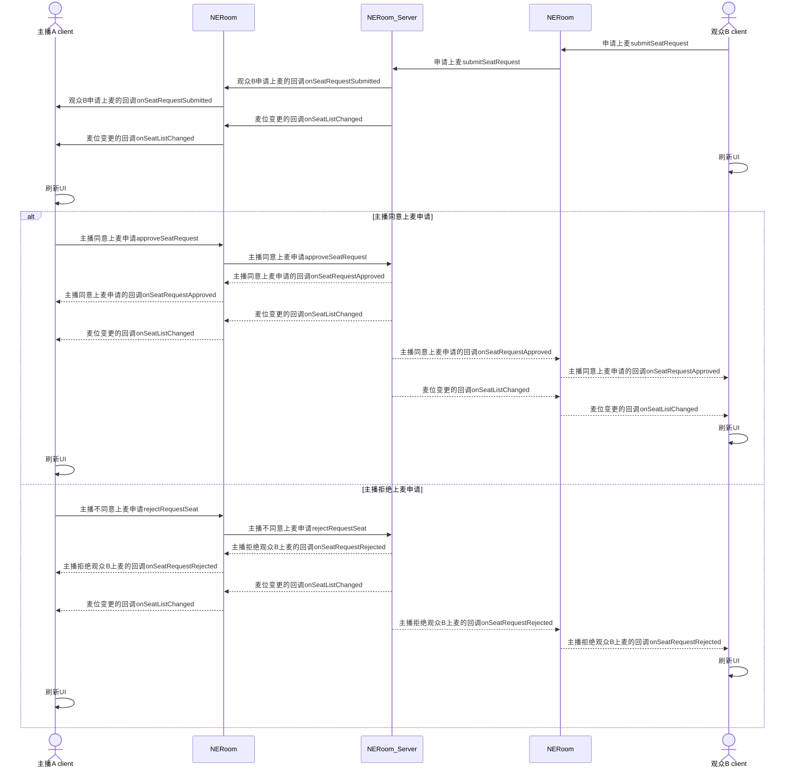
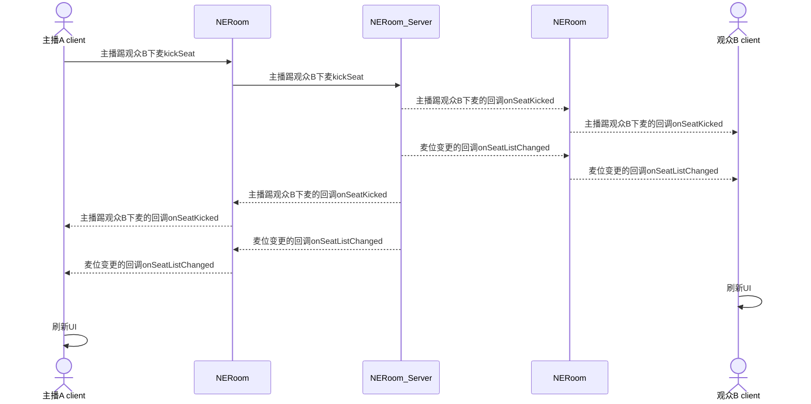
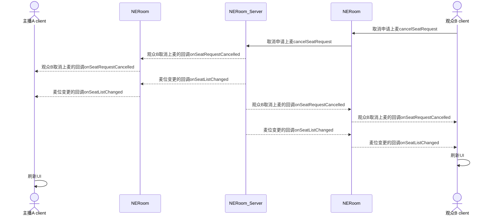
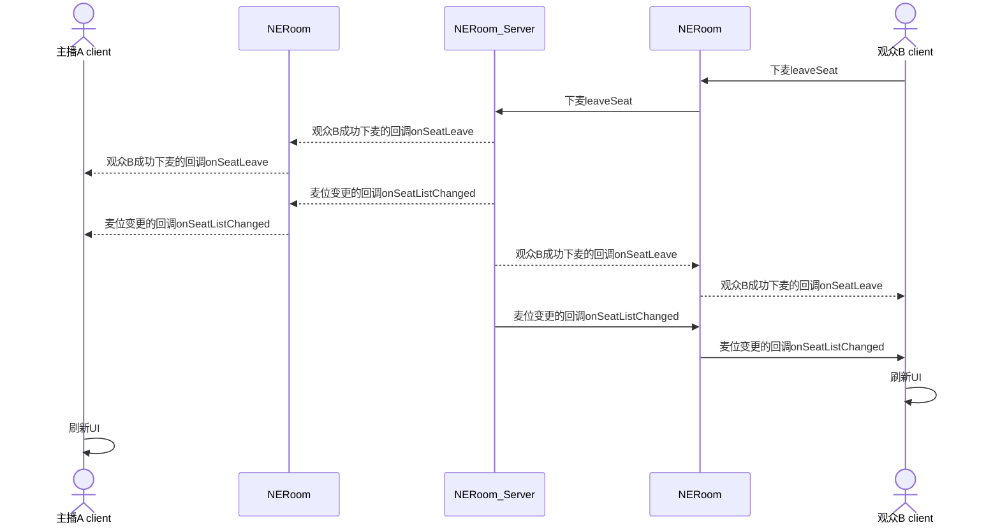

NERoom 的麦位管理功能包括：上麦、下麦、抱麦、踢麦等。在语聊房、 K 歌、直播等场景中，主播和观众连麦是非常热门的玩法。通过多人实时互动，可以活跃房间氛围、激发观众参与热情，进而提升产品活跃度。

<!--目前创建房间中未说明麦位相关设置

## 注意事项
- 您可以在创建房间时，设置麦位相关的初始化配置，包括麦位数量和麦位申请审批模式，具体请参见 [创建房间](https://doc.yunxin.163.com/neroom/guide/Dc2Mzk5MjE?platform=flutter)。
- 目前只支持在创建房间时设置麦位数量，麦位数量最大为 20，在房间正常使用过程中无法修改麦位数量。
-->

## 添加麦位事件监听

主播和观众进入房间后，调用 [`seatController.addEventCallback`](https://pub.dev/documentation/netease_roomkit/latest/netease_roomkit/NERoomSeatController/addEventCallback.html) 方法，监听麦位相关的事件。

示例代码如下：

```Dart
final _eventCallbacks = <NEVoiceRoomEventCallback>{};
_currentRoomContext?.seatController.addEventCallback(_seatEventCallback);
```

## 主播邀请观众上麦（抱麦）

### API 调用时序图


  
### 实现方法

1. 主播调用 [`sendSeatInvitation`](https://pub.dev/documentation/netease_roomkit/latest/netease_roomkit/NERoomSeatController/sendSeatInvitation.html) 方法邀请观众上麦。

    参数 | 类型 | 描述
    --- | --- | ---
    seatIndex | Integer  | 麦位位置。<!--<br>麦位的最大数量可以在<a href="https://doc.yunxin.163.com/neroom/guide/Dc2Mzk5MjE?platform=flutter" target="_blank">创建房间</a>时设置。 -->
    user | String | 待邀请的观众的用户 ID。|

    示例代码如下：

    ```Dart
    var ret = await _currentRoomContext!.seatController
            .sendSeatInvitation(seatIndex, account);
        return ret;
    ```

2. （可选）观众调用 [`acceptSeatInvitation`](https://pub.dev/documentation/netease_roomkit/latest/netease_roomkit/NERoomSeatController/acceptSeatInvitation.html) 方法同意上麦邀请 或调用 [`rejectSeatInvitation`](https://pub.dev/documentation/netease_roomkit/latest/netease_roomkit/NERoomSeatController/rejectSeatInvitation.html) 方法拒绝上麦邀请。

    同意上麦邀请示例代码如下：

    ```Dart
    var ret =
            await _currentRoomContext!.seatController.acceptSeatInvitation();
        return ret;
    ```

    拒绝上麦邀请示例代码如下：

    ```Dart
    var ret =
            await _currentRoomContext!.seatController.rejectSeatInvitation();
        return ret;
    ```

    <!-- - 若在 <a href="https://doc.yunxin.163.com/neroom/guide/Dc2Mzk5MjE?platform=flutter" target="_blank">创建房间</a> 时设置了需要观众同意上麦：观众需要执行该操作。
    - 若在 <a href="https://doc.yunxin.163.com/neroom/guide/Dc2Mzk5MjE?platform=flutter" target="_blank">创建房间</a> 时设置了观众自动同意上麦：观众无需执行该操作。 -->

3. 触发同意上麦的回调 `seatInvitationAcceptedCallback` 和麦位变更的回调 `seatListChangedCallback`。

4. 房间内所有成员收到 `seatListChangedCallback` 回调后，刷新麦位展示的 UI。

## 观众申请上麦

### API 调用时序


  
### 实现方法

1. 观众 B 调用 [`submitSeatRequest`](https://pub.dev/documentation/netease_roomkit/latest/netease_roomkit/NERoomSeatController/submitSeatRequest.html) 方法申请上麦。

    参数 | 类型 | 描述
    --- | --- | ---
    seatIndex | Integer | 指定上麦后的麦位位置。该参数为可选，如果不传该参数，则自动占用当前空的麦位中的第一个。<!-- <br>麦位的最大数量可以在 [创建房间](https://doc.yunxin.163.com/neroom/guide/Dc2Mzk5MjE?platform=flutter) 时设置。 -->
    exclusive| bool | 是否独占麦位。如果麦位为独占模式，则在管理员处理该请求之前，其他人无法申请该麦位。

2. 主播收到观众 B 申请上麦的回调 `seatRequestSubmittedCallback`。

3. 主播同意或拒绝观众 B 上麦。

    - 主播调用 [`approveSeatRequest`](https://pub.dev/documentation/netease_roomkit/latest/netease_roomkit/NERoomSeatController/approveSeatRequest.html) 方法同意观众 B 上麦。

    - 主播调用 [`rejectSeatRequest`](https://pub.dev/documentation/netease_roomkit/latest/netease_roomkit/NERoomSeatController/rejectSeatRequest.html) 方法拒绝观众 B 上麦。

    参数 | 类型 | 描述
    --- | --- | ---
    seatIndex | Int | 麦位序号
    user | String | 申请上麦的观众的用户 ID。
    operateBy | String | 操作者

4. 观众 B 收到主播同意上麦申请的回调 `seatRequestApprovedCallback` 或主播拒绝上麦申请的回调 `seatRequestRejectedCallback`。

### 示例代码

```Dart
//观众申请上麦时指定麦位
var ret = await _currentRoomContext!.seatController
          .submitSeatRequest(seatIndex, exclusive);
      return ret;

//主播同意上麦申请
var ret =
          await _currentRoomContext!.seatController.approveSeatRequest(account);
      return ret;

// 主播拒绝上麦申请

var ret =
        await _currentRoomContext!.seatController.rejectSeatRequest(account);
    return ret;
```

## 主播将观众移出麦位（踢麦）

### API 调用时序


  
### 实现方法

1. 主播调用 [`kickSeat`](https://pub.dev/documentation/netease_roomkit/latest/netease_roomkit/NERoomSeatController/kickSeat.html) 方法将观众移出麦位。

    参数 | 类型 | 描述
    --- | --- | ---
    user | String | 待移出麦位的观众的用户 ID。

2. 房间内所有成员会收到主播将观众移出麦位的回调 `seatKickedCallback` 和麦位变更的回调 `seatListChangedCallback`。

### 示例代码

```Dart
var ret = await _currentRoomContext!.seatController.kickSeat(account);
return ret;
```

## 观众取消申请上麦

### API 调用时序


  
### 实现方法

1. 观众调用 [`cancelSeatRequest`](https://pub.dev/documentation/netease_roomkit/latest/netease_roomkit/NERoomSeatController/cancelSeatRequest.html) 方法取消申请上麦。

2. 取消申请上麦后，主播收到观众取消上麦的回调 `seatRequestCancelledCallback` 和麦位变更的回调 `seatListChangedCallback`。

### 示例代码

```Dart
var ret = await _currentRoomContext!.seatController
        .cancelSeatInvitation(account);
    return ret;
```

## 观众主动下麦

### API 调用时序


  
### 实现方法

1. 观众调用 [`leaveSeat`](https://pub.dev/documentation/netease_roomkit/latest/netease_roomkit/NERoomSeatController/leaveSeat.html) 方法下麦。

2. 下麦成功后，房间内所有成员收到观众成功下麦的回调 `seatLeaveCallback` 和麦位变更的回调 `seatListChangedCallback`。

### 示例代码

```Dart
var ret = await _currentRoomContext!.seatController.leaveSeat();
    return ret;
```