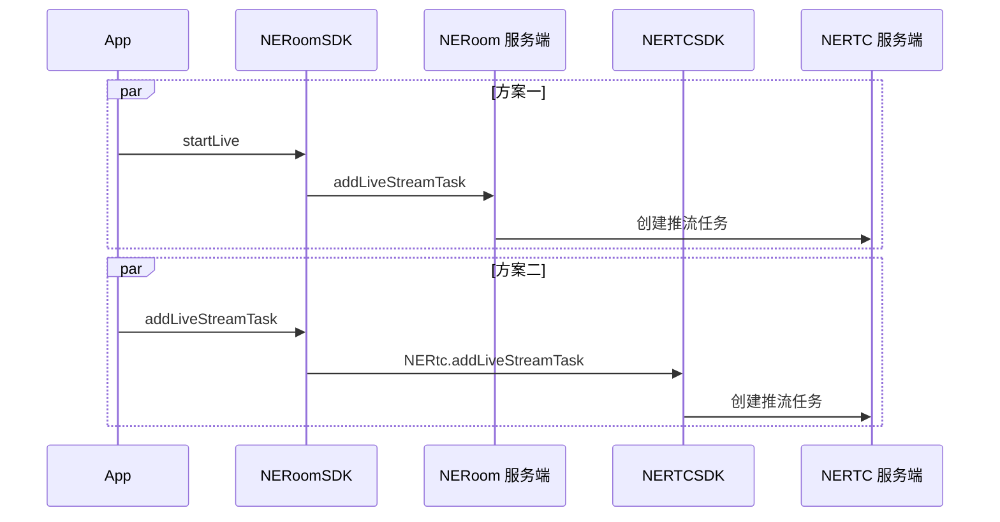

NERoom 基于专业的跨平台视频编解码技术和大规模视频内容分发网络，提供稳定流畅、高可靠、高并发的直播服务，助力轻松打造企业级在线直播平台。

## 功能介绍

直播的应用场景包括：

- **娱乐直播**：面向秀场、游戏等直播场景，提供直播秒开、色彩滤镜、主播观众直播连麦等功能，提高直播人气，活跃直播气氛。
- **电商直播**：电商直播方案实现用户在看直播中边看边卖，支持时移商品介绍、用户互动等，实现快速变现。
- **教育直播**：教育直播加密、动态 URL 防盗链等安全保障防止教学内容泄露，更有高可用服务链路保障教育直播的稳定性。
- **大型直播**：提供海量 CDN 网络和强大的云端媒体处理能力，保障了直播的高并发和高可用。

您可以根据需要选择 [方案一](#方案一) 或 [方案二](#方案二)。两者的区别如下：
- **方案一（推荐）**：使用更简单，提供常用的布局模板。移动客户端互动直播受限于网络状况，为保证直播的稳定性，推荐选择本方案。
- **方案二**：更灵活、更丰富。您可以自定义画面布局、设置音视频流的相关参数。

## 前提条件

创建房间时，已在 `NECreateRoomOptions` 方法中，设置 `enableLive=true`，具体操作方法请参考 [创建房间](https://doc.yunxin.163.com/docs/zU3Mjk0MTk/zk1ODc5MjE?platformId=121094)。

## 功能原理

服务端推流和客户端推流的底层实现逻辑如下图所示。



## 方案一

1. 调用 [getRoomContext](https://doc.yunxin.163.com/neroom/api-refer/web/typedoc/Latest/zh/html/interfaces/index.NERoomService.html#getRoomContext) 方法获取房间上下文。调用此方法时，您需要将 roomUuid 设置为您所加入房间的 ID。

    调用此方法时，您需要将 roomUuid 设置为您所加入房间的 ID。
2. 主播调用 [`startLive`](https://doc.yunxin.163.com/neroom/api-refer/web/typedoc/Latest/zh/html/interfaces/index.NERoomLiveController.html#startLive) 接口开启直播。
    ```
    function startLive(request: NERoomLiveRequest): Promise<NEResult<NERoomLiveInfo>>
    ```
    - `NERoomLiveRequest` 相关参数说明如下表所示。

        名称 | 说明 |
        ---- | ---- |
        title | 直播主题 |
        password | 直播密码。如果密码为空，用户无需密码即可进入直播 |
        liveLayout | 直播布局，包括：<ul><li>1：画廊布局<br></li><li>2：聚焦布局<br></li><li>4：共享屏幕布局</ul> 默认为无布局 |
        userUuidList | 推流用户的 uid 集合 |
        extensionConfig | 扩展配置，透传返回 |

    - `NERoomLiveInfo` 相关参数说明如下表所示。
        名称 | 说明 |
        ---- | ---- |
        title | 直播主题 |
        password | 直播密码。如果密码为空，用户无需密码即可进入直播 |
        liveLayout | 直播布局，包括：<ul><li>1：画廊布局<br></li><li>2：聚焦布局<br></li><li>4：共享屏幕布局</ul>默认为无布局 |
        userUuidList | 推流用户的 uid 集合 |
        extensionConfig | 扩展配置，跟 `NERoomLiveRequest` 中的扩展配置保持一致 |
        taskId | 直播任务编号 |
        pushUrl | 推流地址 |
        pullHttpUrl | HTTP 拉流地址 |
        pullRtmpUrl | RTMP 拉流地址 |
        pullHlsUrl | HLS 拉流地址 |
        pullRtsUrl | RTS 拉流地址 |
        chatRoomId | 直播聊天室房间号 |
        state | 直播状态。包括：<ul><li>init: 直播未开始<br></li><li>started: 直播已开始<br></li><li>ended: 直播已结束<br></li><li>Invalid: 无效状态</li></ul>默认值：Invalid |

    **示例代码如下：**

    ```JavaScript
    /**
    * 获取房间上下文 NERoomContext
    * @param roomUuid 房间 ID
    */
    const NERoomContext = NERoomService.getRoomContext(roomUuid)

    /**
    * 开始直播
    * @param 直播属性
    */
    NERoomContext.liveController.startLive({
    title: 'start',
    liveLayout: NERoomLiveLayout.GALLERY
    password: '123456'
    userUuidList: ['123']
    extensionConfig: 'extensionConfig'
    }).then(res => {
        console.log(res, 'startLive success')
    }).catch(err => {
        console.error(res, 'startLive fail')
    })

    ```

3. 调用 [`updateLive`](https://doc.yunxin.163.com/neroom/api-refer/web/typedoc/Latest/zh/html/interfaces/index.NERoomLiveController.html#updateLive) 接口更新直播。

    参数说明请参考 `startLive` 中的参数说明。

    **示例代码如下：**

    ```JavaScript
    /**
    * 获取房间上下文 NERoomContext
    * @param roomUuid 房间 ID
    */
    const NERoomContext = NERoomService.getRoomContext(roomUuid)

    /**
    * 开始直播
    * @param 更新属性
    */
    NERoomContext.liveController.updateLive({
    title: 'start',
    liveLayout: NERoomLiveLayout.GALLERY
    password: '123456'
    userUuidList: ['123']
    extensionConfig: 'extensionConfig'
    }).then(res => {
        console.log(res, 'updateLive success')
    }).catch(err => {
        console.error(res, 'updateLive fail')
    })

    ```

4. 调用 [`stopLive`](https://doc.yunxin.163.com/neroom/api-refer/web/typedoc/Latest/zh/html/interfaces/index.NERoomLiveController.html#stopLive) 接口停止直播。

    **示例代码如下：**

    ```JavaScript
    /**
    * 获取房间上下文 NERoomContext
    * @param roomUuid 房间 ID
    */
    const NERoomContext = NERoomService.getRoomContext(roomUuid)

    /**
    * 停止直播
    */
    NERoomContext.liveController.stopLive().then(res => {
        console.log(res, 'stopLive success')
    }).catch(err => {
        console.error('stopLive fail')
    })
    ```

5. 调用 [`getLiveInfo`](https://doc.yunxin.163.com/neroom/api-refer/web/typedoc/Latest/zh/html/interfaces/index.NERoomLiveController.html#getLiveInfo) 接口获取直播信息。

    参数说明请参考 `startLive` 中的参数说明。

    **示例代码如下：**

    ```JavaScript
    /**
    * 获取房间上下文 NERoomContext
    * @param roomUuid 房间 ID
    */
    const NERoomContext = NERoomService.getRoomContext(roomUuid)

    /**
    * 获取直播信息
    */
    NERoomContext.liveController.getLiveInfo().then(res => {
        console.log(res, 'getLiveInfo success')
    }).catch(err => {
        console.error('getLiveInfo fail')
    })

    ```

6. 当直播状态变更，会触发 `onRoomLiveStateChanged` 回调，通知房间内成员直播状态变更。

    监听直播状态变更的示例代码如下：

    ```JavaScript
    /**
    * 获取房间上下文 NERoomContext
    * @param roomUuid 房间 ID
    */
    const NERoomContext = NERoomService.getRoomContext(roomUuid)

    /**
    * 获取直播信息
    */
    NERoomContext.addRoomListener({
        ...other,
        onRoomLiveStateChanged: (state: NERoomLiveState) => {
        console.log('onRoomLiveStateChanged', state)
        }
    })

    ```

## 方案二

### 注意事项

一个房间最多创建 3 个旁路推流任务。

### 配置步骤

1. 调用 [getRoomContext](https://doc.yunxin.163.com/neroom/api-refer/web/typedoc/Latest/zh/html/interfaces/index.NERoomService.html#getRoomContext) 方法获取房间上下文。调用此方法时，您需要将 roomUuid 设置为您所加入房间的 ID。

    调用此方法时，您需要将 roomUuid 设置为您所加入房间的 ID。
2. 调用 [`addLiveStreamTask`](https://doc.yunxin.163.com/neroom/api-refer/web/typedoc/Latest/zh/html/interfaces/index.NERoomLiveController.html#addLiveStreamTask) 接口添加旁路推流任务。

    ::: note note
    每次只能增加一路旁路推流地址。如需推送多路流，则需多次调用该方法。
    :::

    `NERoomLiveStreamTaskInfo` 的参数说明如下表所示。

    参数 | 说明 |
    ---- | ---- |
    config | 配置音视频流编码参数。具体参数说明请参考下表。 |
    extraInfo | 预留参数，用户自定义的发送到旁路推流客户端的信息，用于填充视频中 SEI 帧内容。<br>长度不能超过 4096 字节。 |
    layout | 自定义房间画面的各路视频布局方式。具体参数说明请参考下表。 |
    serverRecordEnabled | 旁路推流是否需要进行音视频录制。可设置为：<ul><li>true：启动录制。</li><li>false：关闭录制。</li></ul>默认值：false。 |
    taskId | 自定义的推流任务 ID。请保证此 ID 唯一。<br>taskId 由字母、数字、下划线（_）组成，最大 64 个字符。 |
    streamUrl | 推流地址。例如 rtmp://example.url。 |

    `config` 的参数说明如下表所示。

    参数 | 说明 |
    --- | --- |
    singleVideoPassThrough | <ul><li>true：表示开启视频透传。开启后，如果房间中只有一路视频流输入，则不对输入视频流进行转码，不遵循转码布局，直接推流 CDN。</li><li>false：表示关闭视频透传。关闭后，无论房间中是否只有一路视频流，都按照 `layout` 设置的布局进行转码推流。   </li></ul>默认值：false。 |
    audioBitrate | 音频推流码率。单位为 kbps，取值范围为 10~192。语音场景建议设置为 64 及以上码率，音乐场景建议设置为 128 及以上码率。 |
    sampleRate | 音频推流采样率。默认值为 NERtcLiveStreamAudioSampleRate48000 48K。 |
    channels | 音频推流声道数。<ul><li>1：单声道。</li><li>2：（默认）双声道。</li></ul> |
    audioCodecProfile | 音频编码规格。包括 `ProfileHEAAC` 和 `ProfileLCAAC`。 |

    `layout` 的参数说明如下表所示。

    参数 | 类型 | 是否必选 | 示例值 | 说明 |
    --- | --- | --- | --- | --- |
    height | number | 是 | 640 | 整体画布的高度，单位为 px。<br>取值范围为 0~1920，若设置为奇数值，会自动向下取偶。 |
    width | number | 是 | 0 | 整体画布的宽度，单位为 px。<br>取值范围为 0~1920，若设置为奇数值，会自动向下取偶。 |
    backgroundColor | number | 否 | 0 | 画面背景颜色，默认为 0，即黑色。支持以下格式的颜色码：|\
            | | | | - 256 - 256 - R + 256 - G + B 的和。请将对应 RGB 的值分别带入此公式计算即可。 |
    images | NERoomLiveStreamImageInfo[] | 否 | 0 | 设置混流视频中占位图片属性。相关参数说明如下：|\
            | | | | - `url`：占位图片的 URL。例如：www.163.com/test.jpg。 |\
            | | | | - `height`：该占位图片在画布中的高度。<br>取值范围为 0~1920，若设置为奇数值，会自动向下取偶。 |\
           | | | | - `width`：该占位图片在画布中的宽度。<br>取值范围为 0~1920，若设置为奇数值，会自动向下取偶。 |\
            | | | | - `x`：设置占位图片左上角在画布的横轴坐标值。<br>取值范围为 0~1920，若设置为奇数值，会自动向下取偶。 |\
            | | | | - `y`：设置占位图片左上角在画布的纵轴坐标值。<br>取值范围为 0~1920，若设置为奇数值，会自动向下取偶。 |\
            | | | | - `adaption`：用于设置占位图片和指定区域的适应属性。<br>0：适应图片。即保证视频内容全部显示，未覆盖区域默认填充背景色.<br>1：适应区域。即保证所有区域被填满，视频超出部分会被裁剪(默认值)。 |
    userTranscodingList | NERoomLiveStreamUserTranscoding[] | 成员布局数组 | 0 | 房间内各成员布局的数组 |

    画面布局的效果展示及常用布局的配置示例请参考 [旁路推流画面布局](https://doc.yunxin.163.com/interactive-streaming/docs/DY0MTg2Mzc?platform=web#布局示例)。
3. （可选）调用 [`updateLiveStreamTask`](https://doc.yunxin.163.com/neroom/api-refer/web/typedoc/Latest/zh/html/interfaces/index.NERoomLiveController.html#updateLiveStreamTask) 接口更新房间内的旁路推流任务。
4. 调用 [`removeLiveStreamTask`](https://doc.yunxin.163.com/neroom/api-refer/web/typedoc/Latest/zh/html/interfaces/index.NERoomLiveController.html#removeLiveStreamTask) 接口删除旁路推流任务。

### 示例代码

```JavaScript
const taskInfo = {
    taskId: "taskId",
    streamUrl: "streamUrl",
    serverRecordEnabled: false,
    layout: {
        width: 640,
        height: 720,
        backgroundColor: 0,
        images: [{
            width: 640,
            height: 720,
            url: "url",
            x: 0,
            y: 0,
        }],
        userTranscodingList: [
            {
                uuid: "uuid",
                videoPush: true,
                audioPush: true,
                x: 0,
                y: 0,
                width: 360,
                height: 640,
                zOrder: 0
            }
        ]

    },
    config: {
            singleVideoPassThrough: false,
            audioBitrate: 0,
            channels: 0,
            sampleRate: NERoomLiveStreamAudioSampleRate.SAMPLE_RATE_32000,
            audioCodecProfile = NERoomLiveStreamAudioCodecProfile.LC-AAC,

    }
    extraInfo: "extraInfo"
}
/**
 * 获取房间上下文 NERoomContext
 * @param roomUuid 房间 ID
 */
const NERoomContext = NERoomService.getRoomContext(roomUuid)
NERoomContext.liveController.addLiveStreamTask(taskInfo)
```

删除旁路推流任务

```JavaScript
NERoomContext.liveController.removeLiveStreamTask(taskID)
```

## API 参考

| **方法** | **功能描述** |
| :-- | :-- |
| [startLive](https://doc.yunxin.163.com/neroom/api-refer/web/typedoc/Latest/zh/html/interfaces/index.NERoomLiveController.html#startLive) | 开启直播。 |
| [stopLive](https://doc.yunxin.163.com/neroom/api-refer/web/typedoc/Latest/zh/html/interfaces/index.NERoomLiveController.html#stopLive) | 停止直播。 |
| [updateLive](https://doc.yunxin.163.com/neroom/api-refer/web/typedoc/Latest/zh/html/interfaces/index.NERoomLiveController.html#updateLive) | 更新直播。 |
| [getLiveInfo](https://doc.yunxin.163.com/neroom/api-refer/web/typedoc/Latest/zh/html/interfaces/index.NERoomLiveController.html#getLiveInfo) | 获取直播信息。 |
| [addLiveStreamTask](https://doc.yunxin.163.com/neroom/api-refer/web/typedoc/Latest/zh/html/interfaces/index.NERoomLiveController.html#addLiveStreamTask) | 添加旁路推流。 |
| [updateLiveStreamTask](https://doc.yunxin.163.com/neroom/api-refer/web/typedoc/Latest/zh/html/interfaces/index.NERoomLiveController.html#updateLiveStreamTask) | 更新旁路推流。 |
| [removeLiveStreamTask](https://doc.yunxin.163.com/neroom/api-refer/web/typedoc/Latest/zh/html/interfaces/index.NERoomLiveController.html#removeLiveStreamTask) | 删除旁路推流。 |