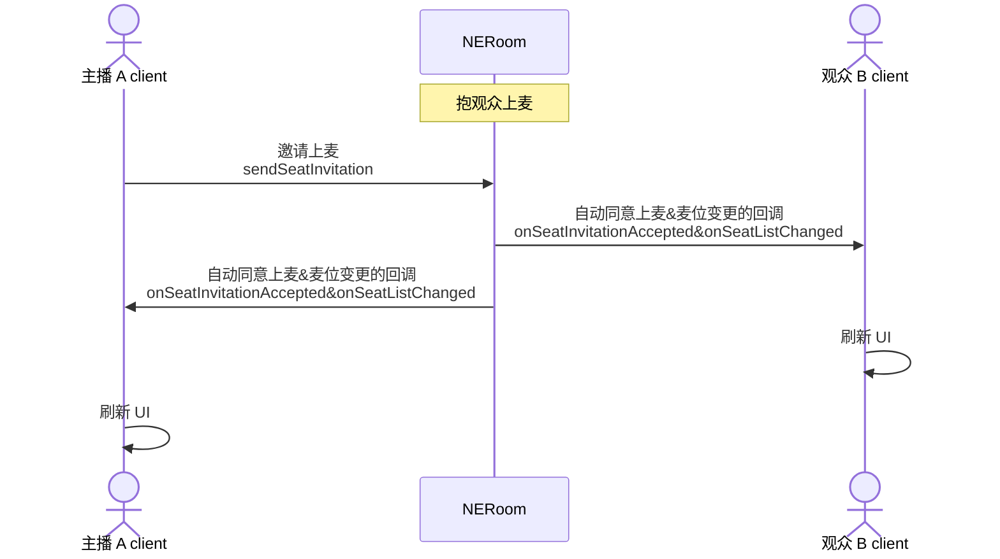
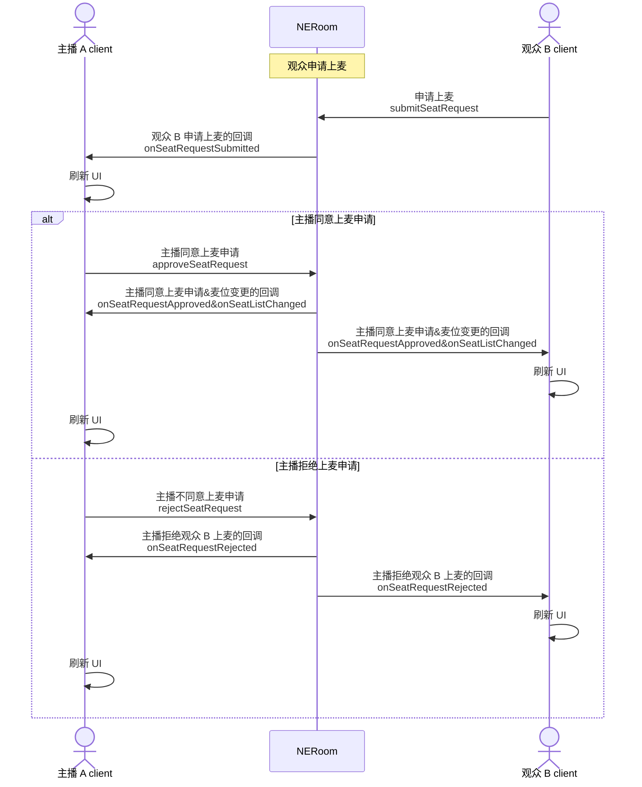
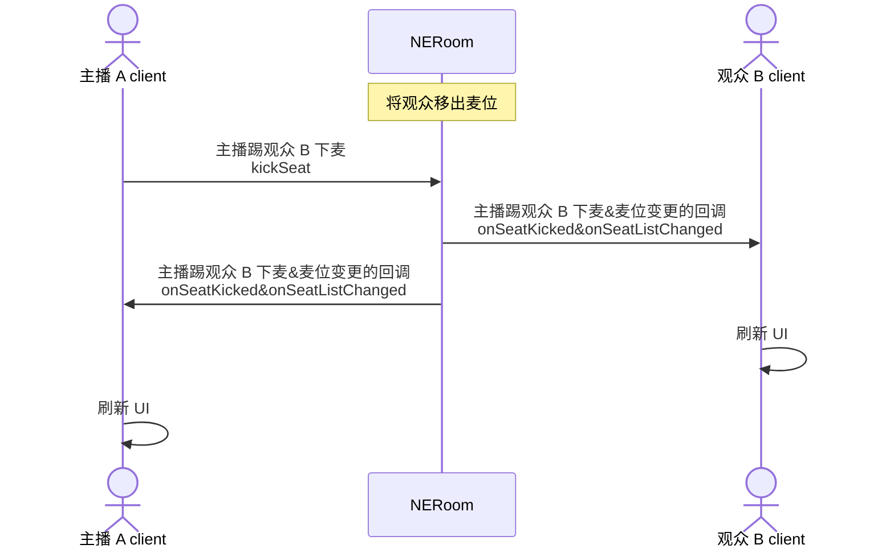
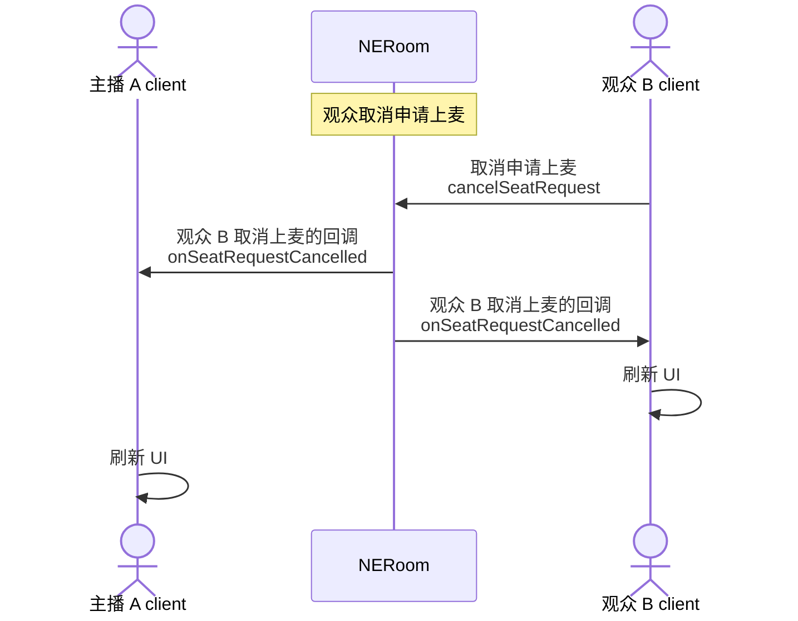
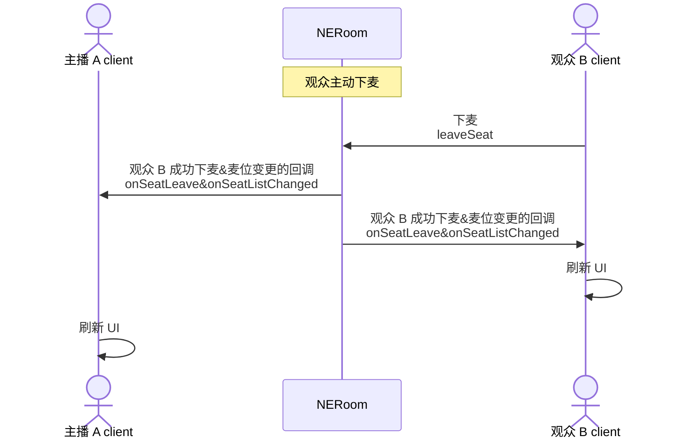

网易云信房间组件（NERoom）的麦位管理功能包括：上麦、下麦、抱麦、踢麦等。在语聊房、K 歌、直播等场景中，主播和观众连麦是非常热门的玩法。通过多人实时互动，可以活跃房间氛围、激发观众参与热情，进而提升产品活跃度。

## 注意事项

- 您可以在创建房间时，设置麦位相关的初始化配置，包括麦位数量和麦位申请审批模式，具体请参考 [创建房间](https://doc.yunxin.163.com/neroom/guide/TU4NDAxMTQ?platform=web)。
- 目前只支持在创建房间时设置麦位数量，麦位数量最大为 20，在房间正常使用过程中无法修改麦位数量。

## 添加麦位事件监听

主播和观众进入房间后，监听麦位相关的事件（[`NESeatEventListener`](https://doc.yunxin.163.com/neroom/references/web/typedoc/Latest/zh/html/interfaces/index.NESeatEventListener.html)）。

示例代码如下：

```JavaScript
/**
 * 获取房间上下文 NERoomContext
 * @param roomUuid 房间 ID
 */
const NERoomContext = NERoomService.getRoomContext(roomUuid)
/**
 * 获取 seatController
 */
const NERoomSeatController = NERoomContext.seatController

/**
 * addSeatEventListener，示例 2 个监听回调函数，其他更多监听回调请参考接口文档
 */
NERoomSeatController.addSeatEventListener({
    onSeatManagerAdded: (managers) => {

    },
    onSeatManagerRemoved: (managers) => {

    }
})
```

## 主播邀请观众上麦（抱麦）

### API 调用时序



### 实现方法

1. 主播调用 [`sendSeatInvitation`](https://doc.yunxin.163.com/neroom/references/web/typedoc/Latest/zh/html/interfaces/index.NERoomSeatController.html#sendseatinvitation) 接口邀请观众上麦。

    参数 | 类型 | 描述
    ---- | ---- | ----
    seatIndex | number | 麦位位置。<br>麦位的最大数量可以在 [创建房间](https://doc.yunxin.163.com/neroom/guide/TU4NDAxMTQ?platform=web) 时设置。
    user | string | 待邀请的观众的用户 ID。
    exclusive | boolean | 是否独占麦位。如果为 true（独占模式），则在管理员处理该请求之前，其他人无法申请该麦位。

2. （可选）观众调用 [`acceptSeatInvitation`](https://doc.yunxin.163.com/neroom/references/web/typedoc/Latest/zh/html/interfaces/index.NERoomSeatController.html#acceptseatinvitation) 接口同意上麦邀请，或调用 [`rejectSeatInvitation`](https://doc.yunxin.163.com/neroom/references/web/typedoc/Latest/zh/html/interfaces/index.NERoomSeatController.html#rejectseatinvitation) 接口拒绝上麦邀请。

    - **若在 [创建房间](https://doc.yunxin.163.com/neroom/guide/TU4NDAxMTQ?platform=web) 时设置了需要观众同意上麦**：观众需要执行该操作。
    - **若在 [创建房间](https://doc.yunxin.163.com/neroom/guide/TU4NDAxMTQ?platform=web) 时设置了观众自动同意上麦**：观众无需执行该操作。

3. 触发同意上麦的回调 [`onSeatInvitationAccepted`](https://doc.yunxin.163.com/neroom/references/web/typedoc/Latest/zh/html/interfaces/index.NESeatEventListener.html#onseatinvitationaccepted) 和麦位变更的回调 [`onSeatListChanged`](https://doc.yunxin.163.com/neroom/references/web/typedoc/Latest/zh/html/interfaces/index.NESeatEventListener.html#onseatlistchanged)。

4. 房间内所有成员收到回调后，刷新麦位展示的 UI。

### 示例代码

主播邀请观众上麦的示例代码如下：

```JavaScript
/**
 * 获取房间上下文 NERoomContext
 * @param roomUuid 房间 ID
 */
const NERoomContext = NERoomService.getRoomContext(roomUuid)
/**
 * 获取 seatController
 */
const NERoomSeatController = NERoomContext.seatController

const userId = '56789';
NERoomSeatController.sendSeatInvitation(undefined, undefined, userId)
```

主播邀请观众上麦时指定麦位的示例代码如下：

```JavaScript
/**
 * 获取房间上下文 NERoomContext
 * @param roomUuid 房间 ID
 */
const NERoomContext = NERoomService.getRoomContext(roomUuid)
/**
 * 获取 seatController
 */
const NERoomSeatController = NERoomContext.seatController

const seartIndex = 2;
const userId = '56789';
NERoomSeatController.sendSeatInvitation(seartIndex, undefined, userId)
```

## 观众申请上麦

### API 调用时序



### 实现方法

1. 观众 B 调用 [`submitSeatRequest`](https://doc.yunxin.163.com/neroom/references/web/typedoc/Latest/zh/html/interfaces/index.NERoomSeatController.html#submitseatrequest) 接口申请上麦。

    参数 | 类型 | 描述
    ---- | ---- | ----
    seatIndex | number | 指定上麦后的麦位位置。<br>该参数为可选，如果不传该参数，则自动占用当前空的麦位中的第一个。<br>麦位的最大数量可以在 [创建房间](https://doc.yunxin.163.com/neroom/guide/TU4NDAxMTQ?platform=web) 时设置。
    exclusive | boolean | 是否独占麦位。如果为 true（独占模式），则在管理员处理该请求之前，其他人无法申请该麦位。
    ext | string | 扩展字段。

2. 主播收到观众 B 申请上麦的回调 [`onSeatRequestSubmitted`](https://doc.yunxin.163.com/neroom/references/web/typedoc/Latest/zh/html/interfaces/index.NESeatEventListener.html#onseatrequestsubmitted)。

3. 主播同意或拒绝观众 B 上麦。

    - 主播调用 [`approveSeatRequest`](https://doc.yunxin.163.com/neroom/references/web/typedoc/Latest/zh/html/interfaces/index.NERoomSeatController.html#approveseatrequest) 接口同意观众 B 上麦。

    - 主播调用 [`rejectSeatRequest`](https://doc.yunxin.163.com/neroom/references/web/typedoc/Latest/zh/html/interfaces/index.NERoomSeatController.html#rejectseatrequest) 接口拒绝观众 B 上麦。

4. 观众 B 收到主播同意上麦申请的回调 [`onSeatRequestApproved`](https://doc.yunxin.163.com/neroom/references/web/typedoc/Latest/zh/html/interfaces/index.NESeatEventListener.html#onseatrequestapproved) 或主播拒绝上麦申请的回调 [`onSeatRequestRejected`](https://doc.yunxin.163.com/neroom/references/web/typedoc/Latest/zh/html/interfaces/index.NESeatEventListener.html#onseatrequestrejected)。

### 示例代码

```JavaScript
/**
 * 获取房间上下文 NERoomContext
 * @param roomUuid 房间 ID
 */
const NERoomContext = NERoomService.getRoomContext(roomUuid)
/**
 * 获取 seatController
 */
const NERoomSeatController = NERoomContext.seatController

//观众申请上麦时不指定麦位

NERoomSeatController.submitSeatRequest()

//观众申请上麦时指定麦位

const seatIndex = 2
NERoomSeatController.submitSeatRequest(seatIndex)

// userId 通过 onSeatRequestSubmitted 获取
const userId = "222"

//主播同意上麦申请

NERoomSeatController.approveSeatRequest(userId)

// 主播拒绝上麦申请

NERoomSeatController.rejectSeatRequest(userId)

```

## 主播将观众移出麦位（踢麦）

### API 调用时序



### 实现方法

1. 主播调用 [`kickSeat`](https://doc.yunxin.163.com/neroom/references/web/typedoc/Latest/zh/html/interfaces/index.NERoomSeatController.html#kickseat) 接口将观众移出麦位。

    参数 | 类型 | 描述
    ---- | ---- | ----
    user | String | 待移出麦位的观众的用户 ID。 |

2. 房间内所有成员会收到主播将观众移出麦位的回调 [`onSeatKicked`](https://doc.yunxin.163.com/neroom/references/web/typedoc/Latest/zh/html/interfaces/index.NESeatEventListener.html#onseatkicked) 和麦位变更的回调 [`onSeatListChanged`](https://doc.yunxin.163.com/neroom/references/web/typedoc/Latest/zh/html/interfaces/index.NESeatEventListener.html#onseatlistchanged)。

### 示例代码

```JavaScript
/**
 * 获取房间上下文 NERoomContext
 * @param roomUuid 房间 ID
 */
const NERoomContext = NERoomService.getRoomContext(roomUuid)
/**
 * 获取 seatController
 */
const NERoomSeatController = NERoomContext.seatController

const userId = '5678'
NERoomSeatController.kickSeat(userId)
```

## 观众取消申请上麦

### API 调用时序



### 实现方法

1. 观众调用 [`cancelSeatRequest`](https://doc.yunxin.163.com/neroom/references/web/typedoc/Latest/zh/html/interfaces/index.NERoomSeatController.html#cancelseatrequest) 接口取消申请上麦。

2. 取消申请上麦后，主播收到观众取消上麦申请的回调 [`onSeatRequestCancelled`](https://doc.yunxin.163.com/neroom/references/web/typedoc/Latest/zh/html/interfaces/index.NESeatEventListener.html#onseatrequestcancelled)。

### 示例代码

```JavaScript
/**
 * 获取房间上下文 NERoomContext
 * @param roomUuid 房间 ID
 */
const NERoomContext = NERoomService.getRoomContext(roomUuid)
/**
 * 获取 seatController
 */
const NERoomSeatController = NERoomContext.seatController

NERoomSeatController.cancelSeatRequest()
```

## 观众主动下麦

### API 调用时序



### 实现方法

1. 观众调用 [`leaveSeat`](https://doc.yunxin.163.com/neroom/references/web/typedoc/Latest/zh/html/interfaces/index.NERoomSeatController.html#leaveseat) 接口下麦。

2. 下麦成功后，房间内所有成员收到观众成功下麦的回调 [`onSeatLeave`](https://doc.yunxin.163.com/neroom/references/web/typedoc/Latest/zh/html/interfaces/index.NESeatEventListener.html#onseatleave) 和麦位变更的回调 [`onSeatListChanged`](https://doc.yunxin.163.com/neroom/references/web/typedoc/Latest/zh/html/interfaces/index.NESeatEventListener.html#onseatlistchanged)。

### 示例代码

```JavaScript
/**
 * 获取房间上下文 NERoomContext
 * @param roomUuid 房间 ID
 */
const NERoomContext = NERoomService.getRoomContext(roomUuid)
/**
 * 获取 seatController
 */
const NERoomSeatController = NERoomContext.seatController

NERoomSeatController.leaveSeat()
```

## 相关错误码

错误码 | 错误码描述
--- | ---
1302 | 麦位已打开
1303 | 观众已申请上麦
1304 | 观众未申请上麦
1305 | 麦位已被其他观众占位
1306 | 观众已在麦上
1307 | 麦序未初始化
1308 | 麦序已初始化
1309 | 主播未将观众抱上麦
1310 | 麦位已关闭
1311 | 麦位都已被占，没有可用的麦位
1312 | 观众已被抱麦，无法再次被抱麦
1313 | 观众未在麦位上
1314 | 麦位数量不能超过 20 个