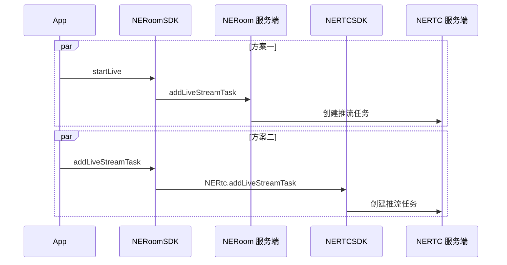

NERoom 的直播基于专业的跨平台视频编解码技术和大规模视频内容分发网络，提供稳定流畅、高可靠、高并发的直播服务，助力轻松打造企业级在线直播平台。

## 功能介绍
直播的应用场景包括：
- 娱乐直播：面向秀场、游戏等直播场景，提供直播秒开、色彩滤镜、主播观众直播连麦等功能，提高直播人气，活跃直播气氛。
- 电商直播：电商直播方案实现用户在看直播中边看边卖，支持时移商品介绍、用户互动等，实现快速变现。
- 教育直播：教育直播加密、动态 URL 防盗链等安全保障防止教学内容泄露，更有高可用服务链路保障教育直播的稳定性。
- 大型直播：提供海量 CDN 网络和强大的云端媒体处理能力，保障了直播的高并发和高可用。

您可以根据需要选择[方案一](#方案一)或[方案二](#方案二)。两者的区别如下：
- 方案一（推荐）：使用更简单，提供常用的布局模板。移动客户端互动直播受限于网络状况，为保证直播的稳定性，推荐选择本方案。
- 方案二：更灵活、更丰富。您可以自定义画面布局、设置音视频流的相关参数。

## 前提条件
创建房间时，已在`NECreateRoomOptions`方法中，设置`enableLive=true`，具体操作方法请参见[创建房间](https://doc.yunxin.163.com/docs/zU3Mjk0MTk/zk1ODc5MjE?platformId=121094)。

## 功能原理
两种推流方案的底层实现逻辑如下图所示。


  

  
## 方案一

1. 调用 `getRoomContext` 接口获取房间上下文。

    调用此方法时，您需要将 `roomUuid` 设置为您所加入房间的 ID。
2. 主播调用 [`startLive`](https://doc.yunxin.163.com/neroom/api-refer/pc/doxygen/Latest/zh/html/classneroom_1_1_i_n_e_room_live_controller.html#af5d514a9372c80ce8b422947053422c8) 接口开启直播。
    ```
    virtual void startLive(const NERoomLiveRequest& live, const NEStartLiveCallback& callback) = 0;
    ```
     - `NERoomLiveRequest` 相关参数说明如下表所示。

        名称 | 描述 |
        ---- | -------------- |
        title | 直播主题 |
        password | 直播密码。如果密码为空，用户无需密码即可进入直播 |
        liveLayout | 直播布局，包括：<ul><li>1：画廊布局<br></li><li>2：聚焦布局<br></li><li>4：共享屏幕布局</ul> |
        userUuidList| List<String> 推流用户的 uid 集合 |
        extensionConfig| 扩展配置，透传返回 |


    - `NERoomLiveInfo` 相关参数说明如下表所示。
        名称 | 描述 |
        ---- | -------------- |
        title | 直播主题 |
        password | 直播密码。如果密码为空，用户无需密码即可进入直播 |
        liveLayout | 直播布局，包括：<ul><li>1：画廊布局<br></li><li>2：聚焦布局<br></li><li>4：共享屏幕布局</ul> |
        userUuidList| List<String> 推流用户的 uid 集合 |
        extensionConfig| 扩展配置，跟 `NERoomLiveRequest` 中的扩展配置保持一致 |
        pushUrl| 推流地址 |
        pullHttpUrl| HTTP 拉流地址 |
        pullRtmpUrl| RTMP 拉流地址 |
        pullHlsUrl| HLS 拉流地址 |
        pullRtsUrl| RTS 拉流地址 |
        state| 直播状态。包括：<ul><li>kNERoomLiveStateInit: 直播未开始<br></li><li>kNERoomLiveStateStarted: 直播已开始<br></li><li>kNERoomLiveStateEnded: 直播已结束</li></ul>|  

     **示例代码如下：**

    ```
    auto context = m_pRoomKit->getRoomService()->getRoomContext(roomUuid);
    if(context){
        auto liveController = m_pRoomContext->getLiveController();
        NERoomLiveRequest info;
        info.liveLayout = kNERoomLiveLayoutGallery;
        info.password = "123456";
        info.title = "testTitle";
        info.userUuidList.push_back("123456");
        liveController->startLive(info, [=](int code, const std::string& msg){
            
        });
    }
    ```  


3. 调用 [`updateLive`](https://doc.yunxin.163.com/neroom/api-refer/pc/doxygen/Latest/zh/html/classneroom_1_1_i_n_e_room_live_controller.html#ac1da9da857bce3aac854323ac0da9d6e) 接口更新直播。

    参数说明请参见 `startLive`中的参数说明。

     **示例代码如下：**

    ```
    auto context = m_pRoomKit->getRoomService()->getRoomContext(roomUuid);
    if(context){
        auto liveController = m_pRoomContext->getLiveController();
        NERoomLiveRequest info;
        info.liveLayout = kNERoomLiveLayoutGallery;
        info.password = "123456";
        info.title = "testTitle";
        info.userUuidList.push_back("123456");
        liveController->updateLive(info, [=](int code, const std::string& msg){
            
        });
    }
    ```

4. 调用 [`stopLive`](https://doc.yunxin.163.com/neroom/api-refer/pc/doxygen/Latest/zh/html/classneroom_1_1_i_n_e_room_live_controller.html#afebf55924d30bdf3531e6f48fa9733bc) 接口停止直播。


     **示例代码如下：**

    ```
    auto context = m_pRoomKit->getRoomService()->getRoomContext(roomUuid);
    if(context){
        auto liveController = m_pRoomContext->getLiveController();
        liveController->stopLive([=](int code, const std::string& msg){
        
        });
    }
    ```


5. 调用 [`getLiveInfo`](https://doc.yunxin.163.com/neroom/api-refer/pc/doxygen/Latest/zh/html/classneroom_1_1_i_n_e_room_live_controller.html#a7e768918e42c95c5530e5664142b2fd3) 接口获取直播信息。

    参数说明请参见 `startLive`中的参数说明。

     **示例代码如下：**

    ```
    auto context = m_pRoomKit->getRoomService()->getRoomContext(roomUuid);
    if(context){
        auto liveController = m_pRoomContext->getLiveController();
        auto liveInfo = liveController->getLiveInfo();
    }
    ```


6. 当直播状态变更，会触发 `onRoomLiveStateChanged` 回调，通知房间内成员直播状态变更。

    监听直播状态变更的示例代码如下：
    ```
    // 添加房间事件监听
    class NERoomListener : public INERoomListener {
    public:
        NERoomListener();
        virtual void onRoomLiveStateChanged(NERoomLiveState state) override;
    };

    auto context = m_pRoomKit->getRoomService()->getRoomContext(roomUuid);
    if(context){
        auto listener = new NERoomListener();
        context->addRoomListener(listener);
    }
    ```


## 方案二
### 注意事项
一个房间最多创建3个旁路推流任务。

### 配置步骤

1. 调用 `getRoomContext` 接口获取房间上下文。

    调用此方法时，您需要将 roomUuid 设置为您所加入房间的 ID。
2. 调用 [`addLiveStreamTask`](https://doc.yunxin.163.com/neroom/api-refer/pc/doxygen/Latest/zh/html/classneroom_1_1_i_n_e_room_live_controller.html#af7ae851152e9b2d5847dc62042e81d5a) 接口添加旁路推流任务。

    ::: note note
    每次只能增加一路旁路推流地址。如需推送多路流，则需多次调用该方法。
    :::

    `NERoomLiveStreamTaskInfo` 的参数说明如下表所示。

    参数 | 说明 | 
    ---- | -------------- | 
    config | 配置音视频流编码参数。具体参数说明请参见下表。 | 
    extraInfo | 预留参数，用户自定义的发送到旁路推流客户端的信息，用于填充视频中 SEI 帧内容。<br>长度不能超过 4096 字节。 |
    layout| 自定义房间画面的各路视频布局方式。具体参数说明请参见下表。  |
    mode | 直播推流模式。可设置为：<ul><li>ModeAudio：推流纯音频。</li><li>ModeVideo：推流音视频。   </li></ul>| 
    serverRecordEnabled | 旁路推流是否需要进行音视频录制。可设置为：<ul><li>true：启动录制。</li><li>false：关闭录制。  </li></ul>默认值：false。 |
    taskId |自定义的推流任务 ID。请保证此 ID 唯一。<br>taskId 由字母、数字、下划线（_）组成，最大 64 个字符。 |
    streamUrl | 推流地址。例如 rtmp://example.url。 | 

    `config` 的参数说明如下表所示。 
    参数 | 说明 |
    ---|---|
    singleVideoPassThrough | <ul><li>true：表示开启视频透传。开启后，如果房间中只有一路视频流输入，则不对输入视频流进行转码，不遵循转码布局，直接推流 CDN。</li><li>false：表示关闭视频透传。关闭后，无论房间中是否只有一路视频流，都按照 `layout` 设置的布局进行转码推流。    </li></ul>默认值：false。 |
    audioBitrate | 音频推流码率。单位为 kbps，取值范围为 10~192。语音场景建议设置为 64 及以上码率，音乐场景建议设置为 128 及以上码率。 |
    sampleRate | 音频推流采样率。默认值为 NERtcLiveStreamAudioSampleRate48000 48K。 |
    channels | 音频推流声道数。 <ul><li>1：单声道。</li><li>2：（默认）双声道。</li></ul> |
    audioCodecProfile  | 音频编码规格。包括 `ProfileHEAAC` 和 `ProfileLCAAC`。 |    

    `layout` 的参数说明如下表所示。 
      
    参数 | 类型 | 是否必选 | 示例值 | 描述 |
    ---|---|---|---|---|
    height | Integer | 必选 | 640 | 整体画布的高度，单位为 px。<br>取值范围为 0~1920，若设置为奇数值，会自动向下取偶。 |
    width | Integer | 必选 | 0 | 整体画布的宽度，单位为 px。<br>取值范围为 0~1920，若设置为奇数值，会自动向下取偶。 |
    backgroundColor | String | 可选 | 0 | 画面背景颜色，默认为 0，即黑色。支持以下格式的颜色码： |\
            |       |       |   | - 256 ✖ 256 ✖ R + 256 ✖ G + B的和。请将对应 RGB 的值分别带入此公式计算即可。|\
            |       |       |   | - 十六进制颜色码，即#RRGGBB 或 RRGGBB 格式。例如 #CC00FF。 |
    backgroundImg | String | 可选 | 0 | 设置混流视频中占位图片属性。相关参数说明如下：|\
            |       |       |   | - `url`：占位图片的URL。例如：www.163.com/test.jpg。|\
            |       |       |   | - `height`：该占位图片在画布中的高度。<br>取值范围为 0~1920，若设置为奇数值，会自动向下取偶。 |\
           |       |       |   | - `width`：该占位图片在画布中的宽度。<br>取值范围为 0~1920，若设置为奇数值，会自动向下取偶。|\
            |       |       |   | - `x`：设置占位图片左上角在画布的横轴坐标值。<br>取值范围为 0~1920，若设置为奇数值，会自动向下取偶。 |\
            |       |       |   | - `y`：设置占位图片左上角在画布的纵轴坐标值。<br>取值范围为 0~1920，若设置为奇数值，会自动向下取偶。|
    userTranscodingList | String | 可选 | 0 |房间内各成员布局的数组  |
    
    画面布局的效果展示及常用布局的配置示例请参见[旁路推流画面布局](https://doc.yunxin.163.com/interactive-streaming/docs/DgyOTc3OTg?platform=windows#布局示例)。
3. （可选）调用 [`updateLiveStreamTask`](https://doc.yunxin.163.com/neroom/api-refer/pc/doxygen/Latest/zh/html/classneroom_1_1_i_n_e_room_live_controller.html#a79ca14b6b439cf9c044582cd9dc6176e) 接口更新房间内的旁路推流任务。
4. 调用 [`removeLiveStreamTask`](https://doc.yunxin.163.com/neroom/api-refer/pc/doxygen/Latest/zh/html/classneroom_1_1_i_n_e_room_live_controller.html#ae4d6d77038e4630cf09842911ba13715) 接口删除旁路推流任务。

  

### 示例代码
```
    NERoomLiveStreamTaskInfo taskInfo;
    taskInfo.taskId = "taskId";
    taskInfo.streamUrl = "streamUrl";
    taskInfo.layout.width = 1080;
    taskInfo.layout.height = 720;
    NERoomLiveStreamUserTranscoding user;
    user.x = 0;
    user.y = 0;
    user.width = 320;
    user.height = 180;
    user.userUuid = "uuid";
    taskInfo.layout.userTranscodingList.push_back(user);
    auto context = m_pRoomKit->getRoomService()->getRoomContext(roomUuid);
    if(context){
        auto liveController = m_pRoomContext->getLiveController();
        liveController->addLiveStreamTask(taskInfo, [=](int code, const std::string& msg){
        });
    }
```


删除旁路推流任务
```
    auto context = m_pRoomKit->getRoomService()->getRoomContext(roomUuid);
    if(context){
        auto liveController = m_pRoomContext->getLiveController();
        liveController->removeLiveStreamTask(taskId, [=](int code, const std::string& msg){
        });
    }

```


## API参考

| **方法** | **功能描述** |
|:--|:--|
|[startLive](https://doc.yunxin.163.com/neroom/api-refer/pc/doxygen/Latest/zh/html/classneroom_1_1_i_n_e_room_live_controller.html#af5d514a9372c80ce8b422947053422c8)|开启直播。|
|[stopLive](https://doc.yunxin.163.com/neroom/api-refer/pc/doxygen/Latest/zh/html/classneroom_1_1_i_n_e_room_live_controller.html#afebf55924d30bdf3531e6f48fa9733bc)|停止直播。|
|[updateLive](https://doc.yunxin.163.com/neroom/api-refer/pc/doxygen/Latest/zh/html/classneroom_1_1_i_n_e_room_live_controller.html#ac1da9da857bce3aac854323ac0da9d6e)|更新直播。|
|[getLiveInfo](https://doc.yunxin.163.com/neroom/api-refer/pc/doxygen/Latest/zh/html/classneroom_1_1_i_n_e_room_live_controller.html#a7e768918e42c95c5530e5664142b2fd3)|获取直播信息。|
|[addLiveStreamTask](https://doc.yunxin.163.com/neroom/api-refer/pc/doxygen/Latest/zh/html/classneroom_1_1_i_n_e_room_live_controller.html#af7ae851152e9b2d5847dc62042e81d5a)|添加旁路推流。|
|[updateLiveStreamTask](https://doc.yunxin.163.com/neroom/api-refer/pc/doxygen/Latest/zh/html/classneroom_1_1_i_n_e_room_live_controller.html#a79ca14b6b439cf9c044582cd9dc6176e)|更新旁路推流。|
|[removeLiveStreamTask](https://doc.yunxin.163.com/neroom/api-refer/pc/doxygen/Latest/zh/html/classneroom_1_1_i_n_e_room_live_controller.html#ae4d6d77038e4630cf09842911ba13715)|删除旁路推流。|

