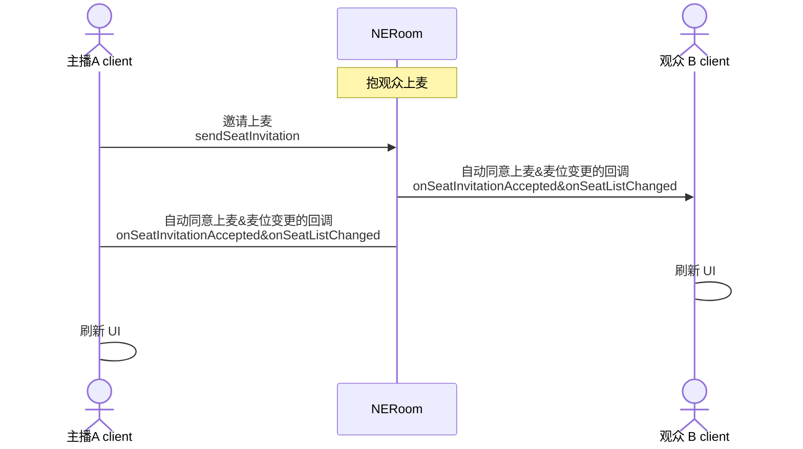
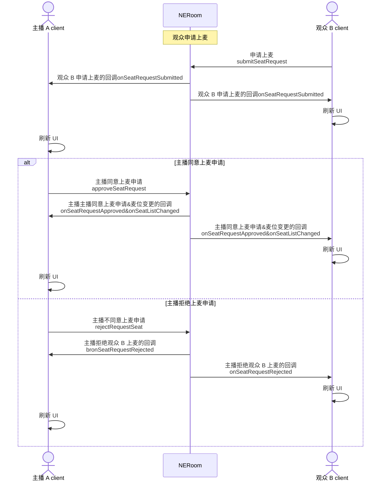
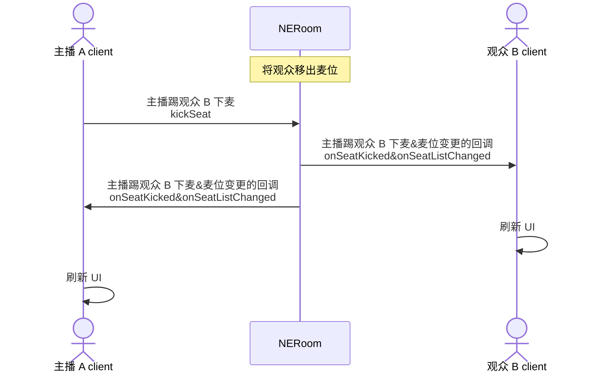
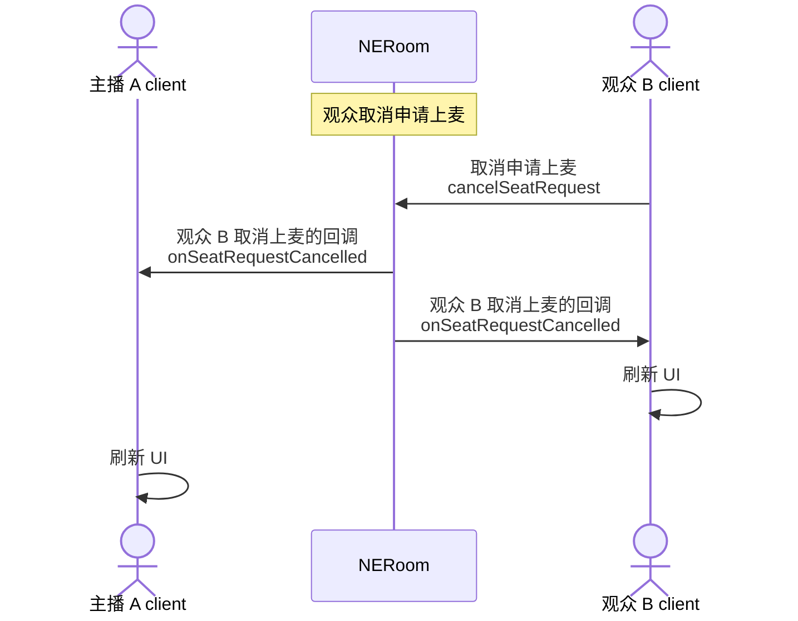
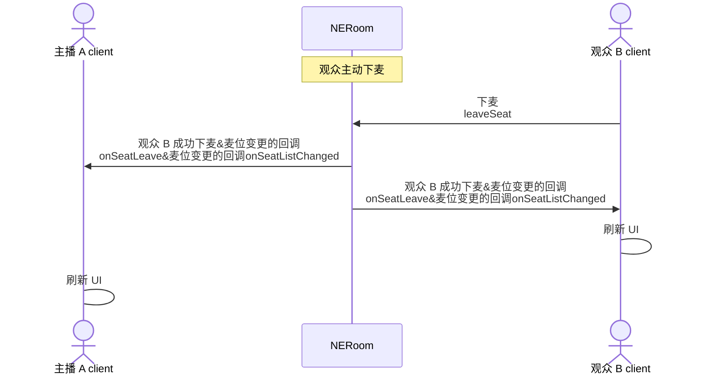

NERoom 的麦位管理功能包括：上麦、下麦、抱麦、踢麦等。在语聊房、 K 歌、直播等场景中，主播和观众连麦是非常热门的玩法。通过多人实时互动，可以活跃房间氛围、激发观众参与热情，进而提升产品活跃度。

## 注意事项

- 您可以在创建房间时，设置麦位相关的初始化配置，包括麦位数量和麦位申请审批模式，具体请参见 [创建房间](https://doc.yunxin.163.com/neroom/guide/zM2NjczNjM?platform=iOS)。
- 目前只支持在创建房间时设置麦位数量，麦位数量最大为 20，在房间正常使用过程中无法修改麦位数量。

## 添加麦位事件监听

主播和观众进入房间后，调用 [`addSeatListener`](https://doc.yunxin.163.com/neroom/references/iOS/jazzy/Latest/zh/html/Classes/NERoomSeatController.html#/c:@M@NERoomKit@objc(cs)NERoomSeatController(im)addSeatListener:) 接口，监听麦位相关的事件。

示例代码如下：

```Objective-C
[self.context.seatController addSeatListener:self];
```

## 主播邀请观众上麦（抱麦）

### API 调用时序



### 实现方法

1. 主播调用 [`sendSeatInvitation`](https://doc.yunxin.163.com/neroom/references/iOS/jazzy/Latest/zh/html/Classes/NERoomSeatController.html#/c:@M@NERoomKit@objc(cs)NERoomSeatController(im)sendSeatInvitation:exclusive:userUuid:callback:) 接口邀请观众上麦。

    参数 | 类型 | 描述
    ---- | ---- | ----
    seatIndex | Integer | 麦位位置。<br>麦位的最大数量可以在 [创建房间](https://doc.yunxin.163.com/neroom/guide/zM2NjczNjM?platform=iOS) 时设置。
    user | String  |待邀请的观众的用户 ID。|

2. （可选）观众调用 [`acceptSeatInvitation`](https://doc.yunxin.163.com/neroom/references/iOS/jazzy/Latest/zh/html/Classes/NERoomSeatController.html#/c:@M@NERoomKit@objc(cs)NERoomSeatController(im)acceptSeatInvitation:) 接口同意上麦邀请，或调用 [`rejectSeatInvitation`](https://doc.yunxin.163.com/neroom/references/iOS/jazzy/Latest/zh/html/Classes/NERoomSeatController.html#/c:@M@NERoomKit@objc(cs)NERoomSeatController(im)rejectSeatInvitation:) 接口拒绝上麦邀请。

    - 若在创建房间时设置了需要观众同意上麦：观众需要执行该操作。
    - 若在创建房间时设置了观众自动同意上麦：观众无需执行该操作。

3. 触发同意上麦的回调 `onSeatInvitationAccepted` 和麦位变更的回调 `onSeatListChanged`。

4. 房间内所有成员收到 `onSeatListChanged` 回调后，刷新麦位展示的 UI。

### 示例代码

主播邀请观众上麦的示例代码如下：

```Objective-C
[self.context.seatController
sendSeatInvitation:userId
            callback:^(NSInteger code, NSString *_Nullable msg, id _Nullable objc) {
            }];
```

主播邀请观众上麦时指定麦位的示例代码如下：

```Objective-C
[self.context.seatController
sendSeatInvitation:self.index
                user:self.userId
            callback:^(NSInteger code, NSString *_Nullable msg, id _Nullable obj) {

            }];
```

## 观众申请上麦

### API 调用时序



### 实现方法

1. 观众 B 调用 [`submitSeatRequest`](https://doc.yunxin.163.com/neroom/references/iOS/jazzy/Latest/zh/html/Classes/NERoomSeatController.html#/c:@M@NERoomKit@objc(cs)NERoomSeatController(im)submitSeatRequest:exclusive:ext:callback:) 接口申请上麦。

    参数 | 类型 | 描述
    ---- | ---- | ----
    seatIndex | Integer  | 指定上麦后的麦位位置。该参数为可选，如果不传该参数，则自动占用当前空的麦位中的第一个。<br>麦位的最大数量可以在创建房间时设置。

2. 主播收到观众 B 申请上麦的回调 `onSeatRequestSubmitted`。

3. 主播同意或拒绝观众 B 上麦。

    - 主播调用 [`approveSeatRequest`](https://doc.yunxin.163.com/neroom/references/iOS/jazzy/Latest/zh/html/Classes/NERoomSeatController.html#/c:@M@NERoomKit@objc(cs)NERoomSeatController(im)approveSeatRequest:callback:) 接口同意观众 B 上麦。

    - 主播调用 [`rejectSeatRequest`](https://doc.yunxin.163.com/neroom/references/iOS/jazzy/Latest/zh/html/Classes/NERoomSeatController.html#/c:@M@NERoomKit@objc(cs)NERoomSeatController(im)rejectSeatRequest:callback:) 接口拒绝观众 B 上麦。

    参数 | 类型 | 描述
    ---- | ---- | ----
    user | String | 申请上麦的观众的用户 ID。|

4. 观众 B 收到主播同意上麦申请的回调 `onSeatRequestApproved` 或主播拒绝上麦申请的回调 `onSeatRequestRejected`。

### 示例代码

```Objective-C
//观众申请上麦时不指定麦位
[self.context.seatController
submitSeatRequest:^(NSInteger code, NSString *_Nullable msg, id _Nullable objc) {

}];

//观众申请上麦时指定麦位
[self.context.seatController
    submitSeatRequest:index
                callback:^(NSInteger code, NSString *_Nullable msg, id _Nullable obj) {

                }];

//主播同意上麦申请
[self.context.seatController
    approveSeatRequest:userId
              callback:^(NSInteger code, NSString *_Nullable msg, id _Nullable objc) {

              }];


// 主播拒绝上麦申请

[self.context.seatController
    rejectSeatRequest:self.userId
              callback:^(NSInteger code, NSString *_Nullable msg, id _Nullable objc) {

              }];
```

## 主播将观众移出麦位（踢麦）

### API 调用时序



### 实现方法

1. 主播调用 [`kickSeat`](https://doc.yunxin.163.com/neroom/references/iOS/jazzy/Latest/zh/html/Classes/NERoomSeatController.html#/c:@M@NERoomKit@objc(cs)NERoomSeatController(im)kickSeatWithSeatIndex:callback:) 接口将观众移出麦位。

    参数 | 类型 | 描述
    ---- | ---- | ---- 
    user | String | 待移出麦位的观众的用户 ID。|

2. 房间内所有成员会收到主播将观众移出麦位的回调 `onSeatKicked` 和麦位变更的回调 `onSeatListChanged`。

### 示例代码

```Objective-C
[self.context.seatController
    kickSeat:userId
    callback:^(NSInteger code, NSString *_Nullable msg, id _Nullable objc) {

    }];
```

## 观众取消申请上麦

### API 调用时序



### 实现方法

1. 观众调用 [`cancelSeatRequest`](https://doc.yunxin.163.com/neroom/references/iOS/jazzy/Latest/zh/html/Classes/NERoomSeatController.html#/c:@M@NERoomKit@objc(cs)NERoomSeatController(im)cancelSeatRequest:) 接口取消申请上麦。

2. 取消申请上麦后，主播收到观众取消上麦的回调 `onSeatRequestCancelled` 和麦位变更的回调 `onSeatListChanged`。

### 示例代码

```Objective-C
[self.context.seatController
    cancelSeatRequest:^(NSInteger code, NSString *_Nullable msg, id _Nullable objc) {

    }];
```

## 观众主动下麦

### API 调用时序



### 实现方法

1. 观众调用 [`leaveSeat`](https://doc.yunxin.163.com/neroom/references/iOS/jazzy/Latest/zh/html/Classes/NERoomSeatController.html#/c:@M@NERoomKit@objc(cs)NERoomSeatController(im)leaveSeat:) 接口下麦。

2. 下麦成功后，房间内所有成员收到观众成功下麦的回调 `onSeatLeave` 和麦位变更的回调 `onSeatListChanged`。

### 示例代码

```Objective-C
[self.context.seatController leaveSeat:^(NSInteger code, NSString *_Nullable msg,
                                          id _Nullable objc) {

}];
```